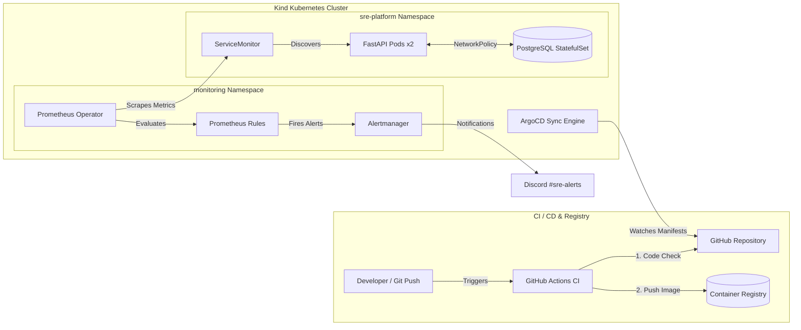

# Cloud-Native SRE & GitOps Platform

Welcome to my enterprise-grade SRE portfolio project! This repository is a Mono-repo designed to showcase a fully automated, secure, and observable cloud-native application deployment.

## Architecture Diagram



This project is built incrementally, focusing on Site Reliability Engineering (SRE) best practices, automated quality gates, and GitOps workflows:

* **1: CI Pipeline & Docker Containerization with Security Scanning** 🟢 (Completed)
* **2: Local Kubernetes Orchestration (Kind) & Helm Charts Packaging** 🟢 (Completed)
* **3: GitOps Continuous Delivery with ArgoCD & Sealed Secrets** 🟢 (Completed)
* **4: Observability & Production-Grade Alerting (kube-prometheus-stack & Alertmanager)** 🟢 (Completed - **Current Stage**)
* **5: Distributed Tracing & Infrastructure as Code (IaC)** ⏳

---

## 🛠️ Tech Stack & SRE Tools

* **Application:** FastAPI (Python 3.12), Pydantic, SQLAlchemy, PostgreSQL
* **Orchestration & Packaging:** Kubernetes, Helm v3, Kind (Kubernetes in Docker)
* **GitOps & Continuous Delivery:** ArgoCD, Bitnami Sealed Secrets
* **Observability & Monitoring:** Prometheus Operator (`kube-prometheus-stack`), Alertmanager, Grafana, `kube-state-metrics`, `prometheus-fastapi-instrumentator`
* **CI/CD:** GitHub Actions
* **Containerization:** Docker (Multi-stage builds, Bookworm slim images)
* **Security & Hardening:** Trivy CLI (Vulnerability Scans), Network Policies, Non-root containers, Sealed Secrets encryption (TLS public key sealing)
* **Quality Gates:** Black (Formatter), Ruff (Linter), Pytest & Pytest-Cov (Unit Tests & Coverage)

---

## 🟢 1st Milestone: Secure CI/CD Pipeline

The first phase of the platform is fully complete and operational. Every git push triggers a robust automated pipeline:

### 1. Code Quality & Testing

* **Linter & Formatter:** Code is strictly checked via `ruff` and `black` to maintain enterprise code styling.
* **Automated Tests:** Unit tests run automatically using `pytest`, generating test coverage reports.

### 2. Multi-stage Docker Builds

* The application is packaged into a highly optimized, multi-stage Docker image using a secure non-root base (`python:3.12-slim-bookworm`).
* Builds are extremely fast (under 25 seconds) and produce minimum-sized artifacts.

### 3. Proactive Security Scanning (Trivy CLI)

* **Filesystem Scan:** Scans the source code for exposed secrets and dependency vulnerabilities before building.
* **Container Image Scan:** Scans the final Docker image layer-by-layer for high and critical vulnerabilities.

> **SRE Implementation Note (Supply-Chain Security):** Instead of relying on a third-party GitHub Action, the pipeline installs and runs the native Trivy CLI directly on the runner. This gives complete control over the security testing environment, and lets the same scan be run identically on a developer's own machine.
> **SRE Implementation Note (Vulnerability Triage):** The pipeline uses `--ignore-unfixed`, so it only fails the build on vulnerabilities that actually have an available patch. Base-image CVEs without an upstream fix (common in any Debian/Python base image) are visible in scan output but don't block delivery — the goal is actionable signal, not noise.

---

## 🟢 2nd Milestone: Local Kubernetes & Helm Packaging (Reliability & Security Hardening)

The second phase transitions the containerized application into an enterprise-ready, self-healing Kubernetes cluster locally.

### 1. Local Kubernetes Clustering (Kind)

* Configured a lightweight local Kubernetes cluster using **Kind** (`kind-config.yaml`) with customized control-plane settings and extra port mappings (80/443) pre-configured to receive an Ingress controller in future steps.

### 2. Enterprise Helm Chart Packaging (`sre-platform-app`)

* Instead of relying on `helm create` boilerplate, the entire environment (FastAPI + Postgres) was hand-built and packaged using **Helm v3**, so every template is understood and intentional.
* Fully decoupled environment configuration from code using a centralized `values.yaml` file, allowing seamless multi-environment deployments.

### 3. High-Availability & Stateful Data (PostgreSQL StatefulSet)

* Deployed PostgreSQL using a **StatefulSet** (instead of a simple Deployment) to guarantee a stable network identity (`postgres-0`) and dedicated Persistent Volume Claims (PVC) for data durability.
* Bound the database to a **Headless Service** (`sre-platform-app-postgres-headless`) to enable reliable DNS-based pod discovery.

### 4. Zero-Trust Network Security (Network Policies)

* Enforced a strict `Default-Deny` ingress **NetworkPolicy** on the database pod.
* Explicitly allows inbound connections **only** from pods matching the FastAPI label selector, on port `5432`. All other network traffic — other namespaces, other pods, a compromised shell — is blocked.

### 5. Self-Healing & Probes (Reliability Engineering)

Three distinct health endpoints, each backing a different Kubernetes probe:

* **Startup Probe** (`/health/startup`): gives the app time to complete schema initialization before liveness/readiness checks even begin.
* **Liveness Probe** (`/health/live`): restarts the container if the process itself locks up. Deliberately does **not** check the database — a slow DB should never cause Kubernetes to kill an otherwise-healthy pod.
* **Readiness Probe** (`/health/ready`): performs an active database check (`SELECT 1`). If it fails, Kubernetes stops routing traffic to that pod without restarting it.

### 6. Zero-Downtime Rollouts

* `RollingUpdate` strategy with `maxSurge: 25%` / `maxUnavailable: 0` — new pods must pass their readiness probe and start receiving traffic before any old pod is terminated.

---

## 🟢 3rd Milestone: GitOps Continuous Delivery (ArgoCD & Sealed Secrets)

The third phase replaces manual `helm install`/`helm upgrade` commands with a fully automated, self-healing GitOps workflow.

### 1. ArgoCD — Pull-Based Deployment

* ArgoCD runs **inside** the cluster and continuously watches this repository's `charts/sre-platform-app` path.
* Any change pushed to `main` is automatically detected, rendered via Helm, and applied to the cluster — no CI pipeline ever needs `kubeconfig` credentials.
* `syncPolicy.automated` is configured with:
* `selfHeal: true` — if someone manually edits a live resource (`kubectl edit`), ArgoCD reverts it back to match Git on the next reconciliation.
* `prune: true` — resources removed from Git are automatically removed from the cluster.

* **Verified live:** scaling the FastAPI deployment from 1 → 2 replicas was done entirely by editing `replicaCount` in `values.yaml` and pushing to Git — zero manual `kubectl`/`helm` commands touched the cluster.

### 2. Bitnami Sealed Secrets — Git-Safe Credential Management

* The PostgreSQL credentials are **never** committed as plaintext. Instead, `kubeseal` encrypts them client-side into a `SealedSecret` custom resource, which is safe to publish in a public GitHub repository.
* Only the Sealed Secrets controller running inside this specific cluster holds the private key needed to decrypt it.
* On sync, the controller automatically decrypts the `SealedSecret` into a regular Kubernetes `Secret`, consumed transparently by the FastAPI and PostgreSQL pods via `secretKeyRef`.

---

## 🟢 4th Milestone: Observability & Production-Grade Alerting

The fourth phase implements full-stack observability and real-time alerting using the **kube-prometheus-stack** operator ecosystem.

### 1. Enterprise Prometheus & Target Discovery Optimization

* Deployed the full **Prometheus Operator** stack in the `monitoring` namespace.
* Fine-tuned `values-override.yaml` with `ruleSelectorNilUsesHelmValues: false` and `ruleNamespaceSelector: {}` to allow Prometheus to automatically discover custom `PrometheusRule` Custom Resources across all cluster namespaces.
* Suppressed un-scrapable Kind control-plane targets (kubeScheduler, kubeEtcd, kubeProxy) to maintain a clean `100% UP` target health status on `localhost:9090/targets`.

### 2. Custom SRE Alerting Rules (`PrometheusRule`)

Implemented 5 key production-grade alerting rules packaged inside `charts/sre-platform-app/templates/prometheusrules.yaml`:

* **`FastAPIHighErrorRate`:** Triggers when HTTP 5xx errors exceed 5% of total requests over a 5-minute window.
* **`FastAPIPodDown`:** Triggers when ready application pods drop below the desired replica count (`kube_pod_status_ready == 0`).
* **`FastAPIHighLatency`:** Triggers when the 95th percentile request latency exceeds 500ms over 5 minutes.
* **`PostgresDown`:** Uses `kube_pod_status_ready` via `kube-state-metrics` to instantly alert if the database StatefulSet pod fails or goes unready.
* **`FastAPIPodRestarting`:** Triggers if application containers restart more than twice within 15 minutes.

### 3. Alertmanager & Real-Time Discord Integration

* Configured **Alertmanager** with custom routing rules and receivers to push alert notifications straight to a dedicated Discord channel (`#sre-alerts`).
* Adapted Discord's webhook API using the `/slack` compatibility endpoint suffix (`.../slack`).
* Validated full end-to-end alerting lifecycle: successfully received live **`[FIRING]`** incidents (e.g., `Watchdog`) and automatic **`[RESOLVED]`** confirmation messages upon incident mitigation.

### 4. GitOps-Compliant Sealed Alertmanager Credentials

* The Discord Webhook URL is fully protected against leaks.
* Fetched the controller's public TLS certificate from `kube-system` and encrypted `alertmanager-config.yaml` using `kubeseal` into `monitoring/sealedsecret-alertmanager.yaml`.
* The encrypted secret is committed safely to Git, and automatically decrypted in-cluster into `alertmanager-config` for Alertmanager to consume.

---

## 🧠 SRE Interview Notes: Key Architectural Decisions

**Why ArgoCD (GitOps/Pull) instead of deploying straight from GitHub Actions (Push)?**

> With a push model, the CI system needs the cluster's `kubeconfig` credentials — an external system holding keys to production infrastructure. With ArgoCD, the controller runs inside the cluster and only needs read access to the Git repo. No inbound firewall ports, no exposed cluster credentials, and automatic drift correction if the live state ever diverges from Git.

**Why StatefulSet instead of Deployment for PostgreSQL?**

> The database needs a stable network identity and dedicated persistent storage tied to that identity. A Deployment's pods are interchangeable; a StatefulSet's are not — `postgres-0` always gets the same PVC back, even after a restart or reschedule.

**Why three separate health endpoints instead of one?**

> Liveness and readiness answer different questions. Liveness asks "is the process alive?" — a slow database should never trigger a restart here. Readiness asks "can this pod serve traffic right now?" — an active DB check that pulls the pod out of rotation without killing it. Conflating the two causes cascading restarts during a transient database hiccup.

**Why `kube_pod_status_ready` over `postgres_exporter` for DB Down alerting?**

> In lightweight Kubernetes deployments, running an extra exporter sidecar adds unnecessary memory overhead. Leveraging `kube-state-metrics` natively exposes pod readiness (`kube_pod_status_ready`) for the PostgreSQL StatefulSet, giving an accurate, immediate signal without extra operational bloat.

**Why Sealed Secrets for Alertmanager Webhooks?**

> Webhook URLs contain sensitive tokens that allow unauthorized third parties to spam or spoof alerts. Sealing the Alertmanager configuration file client-side ensures that sensitive credentials remain strictly encrypted at rest inside Git while staying 100% compliant with GitOps practices.

---

## 🏁 Repository Structure

```text
cloud-native-sre-platform/
├── .github/
│   └── workflows/
│       └── ci.yml                     # Lint, test, Trivy fs+image scan
├── app/
│   ├── src/
│   │   ├── __init__.py
│   │   ├── config.py                  # Environment-driven settings
│   │   ├── database.py                # SQLAlchemy engine, models, DB health check
│   │   ├── main.py                    # FastAPI app & health probes
│   │   └── metrics.py                 # Prometheus counters & histograms
│   ├── tests/
│   │   ├── conftest.py                # Pytest fixtures
│   │   ├── test_health.py             # Health check endpoint tests
│   │   └── test_users.py              # Application functionality tests
│   ├── .dockerignore
│   ├── .env.example
│   ├── Dockerfile                     # Multi-stage, non-root, hardened
│   ├── pytest.ini
│   ├── requirements-dev.txt
│   └── requirements.txt
├── argocd/
│   ├── application.yaml               # App GitOps Application definition
│   └── monitoring-application.yaml    # Monitoring stack GitOps definition
├── charts/
│   └── sre-platform-app/
│       ├── templates/
│       │   ├── _helpers.tpl
│       │   ├── deployment.yaml        # FastAPI deployment spec
│       │   ├── networkpolicy.yaml     # DB isolation policy
│       │   ├── prometheusrules.yaml   # Custom SRE Alerting rules (5 core alerts)
│       │   ├── sealedsecret.yaml      # Encrypted DB credentials
│       │   ├── service.yaml           # App ClusterIP & DB Headless Service
│       │   ├── servicemonitor.yaml    # Metrics scraping target definition
│       │   └── statefulset.yaml       # PostgreSQL StatefulSet & PVC
│       ├── Chart.yaml
│       └── values.yaml
├── monitoring/
│   ├── alertmanager-config.yaml       # Raw Alertmanager routing & receivers
│   ├── sealedsecret-alertmanager.yaml # Encrypted Discord Webhook config
│   └── values-override.yaml           # kube-prometheus-stack Helm overrides
├── kind-config.yaml
└── README.md

```

---

## 🚀 Coming Next

* **Milestone 5 (Tracing & Chaos Engineering):** OpenTelemetry & Jaeger integration for distributed tracing, followed by Locust load testing & HPA chaos scenarios.
* **Milestone 6 (IaC):** Terraform blueprint for cloud infrastructure deployment, validated in CI pipelines.
