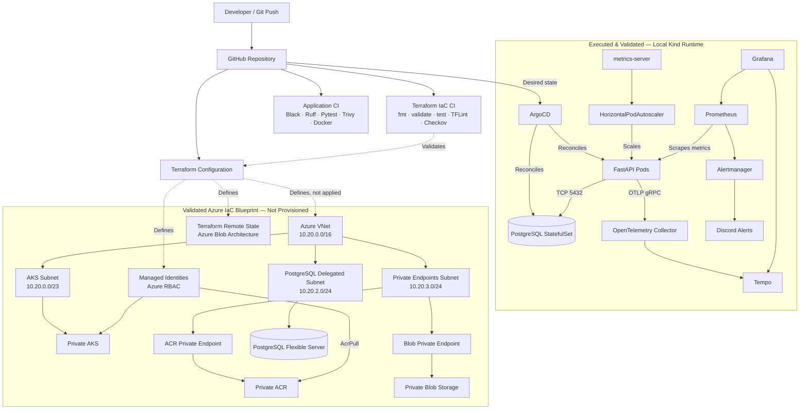

# Cloud-Native SRE & GitOps Platform

An SRE portfolio project built to put **automation, reliability, observability, security, GitOps, autoscaling, distributed tracing, resilience testing, and Infrastructure as Code** into practice on a cloud-native application platform.

I built the project in seven milestones, adding a new operational layer at each stage.

---

## Project Highlights

| Area | Result |
|---|---|
| Application tests | **18/18 passing** |
| Statement coverage | **100%** |
| Sustained load test | **29,286 requests / 0 failures** |
| Throughput | **~165 req/s** |
| p95 latency | **~1.2 s** |
| Load-test users | **150 concurrent users** |
| Pod-kill resilience test | **20,592 requests / 0.09% failure rate** |
| Terraform native tests | **20/20 passing** |
| TFLint | **0 findings** |
| Checkov | **84 passed / 0 failed / 21 documented skips** |

> **Azure deployment status:** The Azure infrastructure defined in Milestone 7 has intentionally **not been provisioned**. It is a production-oriented IaC blueprint validated through Terraform static validation, native mock tests, TFLint, Checkov, and GitHub Actions CI. The repository does not claim that the Azure architecture is currently deployed.

---

# Architecture Overview

The project is split into two validation boundaries:

- **Local Kind Runtime** — actually executed and operationally validated.
- **Azure IaC Blueprint** — statically validated and mock-tested, but not provisioned.


```mermaid
flowchart TB
    Dev[Developer / Git Push] --> Repo[GitHub Repository]

    %% =========================================================
    %% APPLICATION CI
    %% =========================================================
    Repo --> AppCI[Application CI<br/>Black · Ruff · Pytest · Trivy · Docker]

    %% =========================================================
    %% LOCAL EXECUTED RUNTIME
    %% =========================================================
    subgraph Local["Executed & Validated — Local Kind Runtime"]
        ArgoCD[ArgoCD]

        FastAPI[FastAPI Pods]
        Postgres[(PostgreSQL StatefulSet)]

        MetricsServer[metrics-server]
        HPA[HorizontalPodAutoscaler]

        Prometheus[Prometheus]
        Alertmanager[Alertmanager]
        Grafana[Grafana]

        OTel[OpenTelemetry Collector]
        Tempo[Tempo]

        ArgoCD -->|Reconciles| FastAPI
        ArgoCD -->|Reconciles| Postgres

        MetricsServer --> HPA
        HPA -->|Scales| FastAPI

        FastAPI -->|TCP 5432| Postgres

        Prometheus -->|Scrapes metrics| FastAPI
        Prometheus --> Alertmanager
        Alertmanager --> Discord[Discord Alerts]

        FastAPI -->|OTLP gRPC| OTel
        OTel --> Tempo

        Grafana --> Prometheus
        Grafana --> Tempo
    end

    Repo -->|Desired state| ArgoCD

    %% =========================================================
    %% TERRAFORM CI
    %% =========================================================
    Repo --> IaCCI[Terraform IaC CI<br/>fmt · validate · test · TFLint · Checkov]
    Repo --> Terraform[Terraform Configuration]

    IaCCI -. Validates .-> Terraform

    %% =========================================================
    %% AZURE BLUEPRINT
    %% =========================================================
    subgraph Azure["Validated Azure IaC Blueprint — Not Provisioned"]
        VNet[Azure VNet<br/>10.20.0.0/16]

        AKSSubnet[AKS Subnet<br/>10.20.0.0/23]
        PGSubnet[PostgreSQL Delegated Subnet<br/>10.20.2.0/24]
        PESubnet[Private Endpoints Subnet<br/>10.20.3.0/24]

        AKS[Private AKS]
        ACRPE[ACR Private Endpoint]
        ACR[Private ACR]

        AzurePG[(PostgreSQL Flexible Server)]

        BlobPE[Blob Private Endpoint]
        Blob[Private Blob Storage]

        Identity[Managed Identities<br/>Azure RBAC]
        State[Terraform Remote State<br/>Azure Blob Architecture]

        VNet --> AKSSubnet
        VNet --> PGSubnet
        VNet --> PESubnet

        AKSSubnet --> AKS
        PGSubnet --> AzurePG

        PESubnet --> ACRPE
        ACRPE --> ACR

        PESubnet --> BlobPE
        BlobPE --> Blob

        Identity --> AKS
        Identity -->|AcrPull| ACR
    end

    Terraform -. Defines, not applied .-> VNet
    Terraform -. Defines .-> Identity
    Terraform -. Defines .-> State
```

### Responsibility Boundaries

```text
Terraform  → Azure cloud infrastructure
Helm       → Kubernetes application packaging
ArgoCD     → Kubernetes desired-state reconciliation
```

This keeps cloud provisioning separate from the Kubernetes application lifecycle instead of tying both together.

The full Terraform architecture and the reasoning behind it are documented in [`terraform/README.md`](terraform/README.md).

---

# Project Roadmap

All seven planned milestones are complete.

- **1: CI Pipeline & Docker Containerization with Security Scanning** — 🟢 **Completed**
- **2: Local Kubernetes Orchestration & Helm Packaging** — 🟢 **Completed**
- **3: GitOps Continuous Delivery with ArgoCD & Sealed Secrets** — 🟢 **Completed**
- **4: Observability & Production-Grade Alerting** — 🟢 **Completed**
- **5: Autoscaling & Load Testing** — 🟢 **Completed**
- **6: Distributed Tracing & Chaos Engineering** — 🟢 **Completed**
- **7: Infrastructure as Code with Terraform & Azure** — 🟢 **Completed**

---

# Tech Stack

### Application

- Python 3.12
- FastAPI
- Pydantic
- SQLAlchemy
- PostgreSQL

### Kubernetes & Packaging

- Kubernetes
- Kind
- Helm v3
- StatefulSets
- NetworkPolicies
- Startup / Liveness / Readiness probes
- HorizontalPodAutoscaler
- metrics-server

### GitOps

- ArgoCD
- Bitnami Sealed Secrets

### Observability

- Prometheus Operator
- kube-prometheus-stack
- Prometheus
- Grafana
- Alertmanager
- kube-state-metrics
- OpenTelemetry
- OpenTelemetry Collector
- OTLP/gRPC
- Tempo

### Testing & Resilience

- Pytest
- Pytest-Cov
- Locust
- Kubernetes-based load testing
- Chaos / resilience testing
- Terraform native tests

### CI/CD & Security

- GitHub Actions
- Docker
- Multi-stage Docker builds
- Trivy
- Ruff
- Black
- TFLint
- Checkov

### Infrastructure as Code

- Terraform
- AzureRM Provider
- Azure Virtual Network
- Azure Kubernetes Service
- Azure Container Registry
- Azure Database for PostgreSQL Flexible Server
- Azure Blob Storage
- Azure Private Link
- Azure Private DNS
- Azure Managed Identities
- Azure RBAC

---

# Milestone 1 — Secure CI/CD Pipeline

The first milestone set up the CI and security foundation for the rest of the project.

### Application quality gates

Each change goes through:

```text
Black
Ruff
Pytest
Pytest-Cov
```

### Containerization

The FastAPI application is built with a multi-stage Docker image based on:

```text
python:3.12-slim-bookworm
```

The final runtime container:

- runs as a non-root user
- contains only runtime dependencies
- is scanned before being accepted by CI

### Security scanning

Trivy performs:

- filesystem vulnerability scanning
- secret detection
- dependency vulnerability scanning
- container image vulnerability scanning

The application and container CI workflow is defined in:

```text
.github/workflows/ci.yml
```

---

# Milestone 2 — Kubernetes & Helm

The application was then moved into a local Kubernetes environment running on Kind.

### Helm

The application is packaged as a Helm chart, with environment-specific configuration kept in `values.yaml`.

### PostgreSQL

PostgreSQL runs as a StatefulSet with:

- stable pod identity
- persistent storage
- dedicated PVC
- stable service discovery

### NetworkPolicies

Database ingress uses a default-deny approach.

Only the FastAPI application can connect to PostgreSQL on:

```text
TCP/5432
```

### Health probes

The application exposes separate endpoints for startup, liveness, and readiness checks:

```text
/health/startup
/health/live
/health/ready
```

The readiness probe checks whether the database is available, while the liveness probe only checks that the application process is still alive.

So if the database goes down, the pod is taken out of service without restarting an otherwise healthy FastAPI process.

### Rolling updates

The FastAPI Deployment uses:

```text
maxSurge:       25%
maxUnavailable: 0
```

This makes sure replacement pods are ready before the existing replicas are removed.

---

# Milestone 3 — GitOps with ArgoCD

ArgoCD is used instead of manually pushing Kubernetes deployments, so the cluster pulls and reconciles the desired state from Git.

```text
Developer
    ↓
Git Push
    ↓
GitHub
    ↓
ArgoCD detects desired-state change
    ↓
Helm rendering
    ↓
Kubernetes reconciliation
```

ArgoCD uses:

```text
automated sync
selfHeal: true
prune: true
```

I verified the GitOps flow by changing the replica count in Git and letting ArgoCD reconcile it without running `kubectl apply` or `helm upgrade` manually.

### Sealed Secrets

PostgreSQL credentials are not stored in Git as plaintext.

Bitnami Sealed Secrets keeps the secret manifests encrypted in Git, and only the controller inside the cluster can decrypt them.

---

# Milestone 4 — Observability & Alerting

Metrics and alerting are handled with `kube-prometheus-stack`.

### Application metrics

FastAPI exposes Prometheus metrics for:

- HTTP requests
- latency
- HTTP errors
- user-registration activity

### Custom alerts

I added five custom Prometheus alert rules:

```text
FastAPIHighErrorRate
FastAPIPodDown
FastAPIHighLatency
PostgresDown
FastAPIPodRestarting
```

### Alert lifecycle

```text
Application / Kubernetes
        ↓
Prometheus
        ↓
PrometheusRule
        ↓
Alertmanager
        ↓
Discord
```

Alertmanager credentials are also handled through Sealed Secrets instead of being stored in Git as plaintext.

---

# Milestone 5 — Autoscaling, Load Testing & Resilience

## Horizontal Pod Autoscaler

The FastAPI application uses Kubernetes `autoscaling/v2`.

```text
Minimum replicas: 2
Maximum replicas: 5
CPU target:       50%
```

During the load test, the application scaled from:

```text
2
↓
4
↓
5 replicas
```

After the load stopped, it scaled back down to the minimum replica count.

---

## Load Testing

The first high-concurrency test went through `kubectl port-forward` and showed an apparent failure rate of about:

```text
94%
```

After checking the results, the main bottleneck turned out to be `kubectl port-forward`, not the application itself.

I moved Locust inside the Kubernetes cluster so it could send traffic directly to the Service.

Once the test was running inside the cluster, it exposed the actual application bottlenecks:

- restrictive CPU limits
- insufficient database connection-pool capacity
- connection timeout behavior
- an unbounded `GET /users` query

After fixing those issues, the final test produced:

```text
Requests:          29,286
Failures:          0
Failure rate:      0.00%
Throughput:        ~165 req/s
p95 latency:       ~1.2 s
Concurrent users:  150
Duration:          3 minutes
```

The final run stayed stable under sustained load.

---

## Pod-Kill Resilience Test

I forcefully terminated one FastAPI pod while traffic was still running.

Observed result:

```text
Requests:      20,592
Failed:        18
Failure rate:  0.09%
```

The failures only happened during the short window around the pod termination.

Kubernetes recreated the pod automatically while the remaining replicas kept serving traffic.

---

# Milestone 6 — Distributed Tracing & Chaos Engineering

Milestone 6 added request-level tracing and controlled failure testing on top of the existing metrics and alerting setup.

---

## OpenTelemetry

The FastAPI application is instrumented with:

- OpenTelemetry API
- OpenTelemetry SDK
- FastAPI instrumentation
- SQLAlchemy instrumentation
- OTLP/gRPC exporter

Tracing pipeline:

```text
FastAPI / SQLAlchemy
        ↓
OTLP/gRPC
        ↓
OpenTelemetry Collector
        ↓
Tempo
        ↓
Grafana
```

Health and metrics endpoints are excluded from automatic tracing to avoid filling Tempo with unnecessary spans.

---

## End-to-End Trace Validation

I inspected real Kubernetes traffic through Grafana and Tempo.

A database-backed `GET /users` request produced a trace like this:

```text
GET /users
│
├── connect
├── SELECT app_db
├── http send
├── http send
└── http send
```

Database spans included PostgreSQL attributes such as:

```text
db.system = postgresql
db.name   = app_db
db.user   = app_user
```

The trace data also confirmed the parent-child relationship between the FastAPI server span and the SQLAlchemy client spans.

---

## Application Test Coverage

```text
18 tests passed
175 statements
175 statements covered
100% statement coverage
```

Coverage includes:

```text
src/config.py       100%
src/database.py     100%
src/main.py         100%
src/metrics.py      100%
src/tracing.py      100%
TOTAL               100%
```

> 100% statement coverage and end-to-end tracing are separate validation signals. The former validates tested code paths; the latter was validated against the running Kubernetes platform.

---

## Chaos Engineering

The reproducible PowerShell experiments are stored under:

```text
chaos/
├── postgres-latency.ps1
├── postgres-outage.ps1
└── README.md
```

Fault injection uses Linux networking primitives:

```text
tc / netem
iptables
nsenter
```

Runtime identifiers are discovered dynamically instead of being hardcoded.

Both experiments clean up their changes automatically.

---

### PostgreSQL Latency Experiment

Injected fault:

```text
tc netem delay 300ms
```

Baseline:

```text
5/5 requests successful
Average: 8.67 ms
Median:  8.57 ms
```

During fault:

```text
5/5 requests successful
Average: 910.47 ms
Median:  910.30 ms
```

The injected delay increased the observed request latency by roughly **105x**.

After cleanup:

```text
5/5 requests successful
Average: 8.64 ms
Median:  8.53 ms
```

The application did not need to be restarted.

---

### PostgreSQL Dependency Outage

This experiment blocked FastAPI-to-PostgreSQL traffic on TCP/5432.

Observed behavior:

```text
Database requests failed
        ↓
Readiness checks failed
        ↓
FastAPI replicas became NotReady
        ↓
Application processes remained alive
        ↓
Fault was removed
        ↓
Service recovered automatically
```

During the outage:

```text
Requests:               5/5 failed
Ready FastAPI replicas: 0
FastAPI restarts:       0
PostgreSQL:             1/1 Running
```

Tempo captured the failed PostgreSQL connection span together with the SQLAlchemy `OperationalError`.

After cleanup:

```text
Recovery requests: 5/5 successful
FastAPI replicas:  2 ready
FastAPI restarts:  0
PostgreSQL:        1/1
```

This showed that the dependency failure was visible, readiness behaved as expected, cleanup worked, and the service recovered without restarting FastAPI.

---

# Milestone 7 — Infrastructure as Code with Terraform & Azure

Milestone 7 adds a reusable Azure Infrastructure as Code layer while keeping Terraform, Helm, and ArgoCD responsible for different parts of the platform.

> **Important:** The Azure infrastructure is a validated blueprint and has not been provisioned.

---

## Terraform Structure

```text
terraform/
├── README.md
├── bootstrap/
├── environments/
│   └── dev/
│       └── tests/
└── modules/
    ├── acr/
    ├── aks/
    ├── networking/
    ├── postgresql/
    └── storage/
```

The development environment is composed from reusable modules for:

```text
Networking
Azure Container Registry
Azure Kubernetes Service
PostgreSQL Flexible Server
Azure Blob Storage
```

---

## Azure Network Architecture

VNet:

```text
10.20.0.0/16
```

Subnets:

```text
AKS                 10.20.0.0/23
PostgreSQL          10.20.2.0/24
Private Endpoints   10.20.3.0/24
```

Dedicated NSGs are associated with all three subnets.

### PostgreSQL NSG

The east-west traffic rules are:

```text
ALLOW  AKS subnet        → PostgreSQL TCP/5432
ALLOW  PostgreSQL subnet → PostgreSQL TCP/5432
DENY   other VNet traffic → PostgreSQL subnet
```

The PostgreSQL self-subnet rule is kept so Flexible Server can communicate correctly inside the delegated subnet.

### Private Endpoint NSG

```text
ALLOW  AKS subnet         → Private Endpoints TCP/443
DENY   other VNet traffic → Private Endpoints subnet
```

The AKS NSG does not use a blanket inbound deny rule.

Workload-level isolation inside Kubernetes is handled by Cilium/Kubernetes Network Policies.

---

## Azure Container Registry

The registry is configured with:

```text
Premium SKU
Admin account disabled
Public network access disabled
Dedicated data endpoint enabled
30-day untagged manifest retention
Private Endpoint
Private DNS
```

Private DNS:

```text
privatelink.azurecr.io
```

AKS pulls images through managed identity with the `AcrPull` role instead of using registry admin credentials.

---

## Private AKS

The AKS configuration includes:

```text
Private cluster
Public API FQDN disabled
Local accounts disabled
Azure RBAC
Kubernetes RBAC
Azure Policy
OIDC issuer
Workload Identity
Azure CNI Overlay
Cilium dataplane
Cilium network policy
Automatic patch upgrades
NodeImage OS upgrades
Secrets Store CSI rotation
```

### System Node Pool

```text
VM:            Standard_D4ds_v5
Autoscaling:   2 → 5
Max pods:      110
OS disk:       Ephemeral / 60 GB
Public IP:     Disabled
```

The system pool is reserved for critical Kubernetes workloads.

### Application Node Pool

```text
VM:            Standard_D2ds_v5
Autoscaling:   1 → 3
Max pods:      110
OS disk:       Ephemeral / 60 GB
Public IP:     Disabled
```

---

## Managed Identity & RBAC

AKS uses two explicit User Assigned Managed Identities:

```text
Control Plane Identity
Kubelet Identity
```

RBAC relationships:

```text
Control Plane Identity
    ├── Network Contributor → AKS subnet
    └── Managed Identity Operator → Kubelet identity

Kubelet Identity
    └── AcrPull → Azure Container Registry
```

Using explicit identities makes the Terraform dependencies clear and avoids relying on an automatically generated kubelet identity.

---

## PostgreSQL Flexible Server

The managed PostgreSQL configuration uses:

```text
PostgreSQL version:     16
SKU:                    B_Standard_B1ms
Storage:                32 GB
Backup retention:       7 days
Public network access:  Disabled
Private VNet integration
Delegated subnet
Private DNS
```

The application database uses:

```text
Name:       app_db
Charset:    UTF8
Collation:  en_US.utf8
```

The administrator password is passed as a sensitive and ephemeral Terraform input through the provider's write-only password attribute.

Lifecycle protection is enabled for the stateful database resources.

---

## Private Blob Storage

Application object storage is configured with:

```text
StorageV2
Standard tier
ZRS
HTTPS only
TLS 1.2
Public network access disabled
Shared Key authorization disabled
OAuth authentication by default
Infrastructure encryption
Blob versioning
14-day deletion retention
Private container
Private Endpoint
Private DNS
```

Private DNS:

```text
privatelink.blob.core.windows.net
```

---

## Terraform Remote State

A separate bootstrap configuration defines the Azure Blob backend used for Terraform state.

It includes:

```text
Resource Group
Storage Account
Private tfstate container
Blob versioning
Soft-delete protection
Microsoft Entra RBAC
Storage Blob Data Contributor
Shared Key disabled
```

The bootstrap starts with local Terraform state, since the remote backend does not exist yet.

The development environment includes:

```text
backend.hcl.example
```

while the actual:

```text
backend.hcl
```

is excluded from Git.

For GitHub-hosted runners, the backend can expose a public endpoint while still requiring Microsoft Entra authentication and keeping Shared Key authorization disabled.

With a private runner, the backend could instead sit behind Private Link.

---

## Terraform Native Tests

Terraform native tests use mock providers with deterministic overrides.

These tests do not need Azure credentials or live Azure API calls.

All of the tests are planning-only and do not provision infrastructure.

Current coverage:

```text
ACR              3
AKS              3
Networking       6
PostgreSQL       4
Storage          3
Dev Composition  1
──────────────────
TOTAL           20
```

Result:

```text
20 passed
0 failed
```

The tests cover infrastructure checks such as:

- private AKS controls
- separate system and application node pools
- managed identity relationships
- network segmentation
- PostgreSQL delegation
- explicit NSG rules
- Private Endpoint policy enforcement
- ACR private connectivity
- Storage security controls
- root environment composition

These tests do **not** replace testing against a real Azure deployment.

---

## Terraform Quality Gates

The Terraform codebase passes:

```text
terraform fmt
terraform validate
terraform test
TFLint
Checkov
```

Current result:

```text
Terraform tests: 20/20 passed
TFLint:          0 findings

Checkov:
  Passed:        84
  Failed:        0
  Skipped:       21
```

The Checkov skips are documented inline instead of being silently ignored.

Examples include controls related to:

- paid AKS SLA
- host encryption
- customer-managed encryption keys
- multi-region ACR
- PostgreSQL geo-redundant backups
- Azure Monitor integration
- private Terraform backend runner connectivity

These skips are mostly deployment-specific hardening, compliance, availability, or cost choices rather than hidden failures in the baseline.

---

## Dedicated Terraform CI

Infrastructure validation has a separate workflow:

```text
.github/workflows/terraform-ci.yml
```

The pipeline is split into three independent jobs:

```text
Terraform Validate & Test
TFLint
Checkov Security Scan
```

Terraform CI performs:

```text
terraform fmt -check
terraform init -backend=false
terraform validate
terraform test
```

The workflow intentionally contains no:

```text
Azure credentials
az login
Azure OIDC authentication
terraform apply
live Azure provisioning
```

So this workflow acts as an offline IaC quality gate, not as a deployment pipeline.

---

## Validation Boundary

Milestones 1–6 validate a real running environment:

```text
Kubernetes
GitOps
Metrics
Alerting
Autoscaling
Load behavior
Distributed tracing
Chaos experiments
Recovery behavior
```

Milestone 7 validates a different layer:

```text
Terraform source
      ↓
Formatting
      ↓
Static validation
      ↓
Mock infrastructure tests
      ↓
TFLint
      ↓
Checkov
      ↓
GitHub Actions CI
```

The project therefore includes both:

```text
Executed & Validated Local Runtime
                +
Validated Azure Infrastructure Blueprint
```

without presenting the unprovisioned Azure side as if it were already running.

For the full Infrastructure as Code deep dive, see [`terraform/README.md`](terraform/README.md).

---

# CI Workflows

Application and infrastructure validation are kept in separate workflows.

```text
.github/workflows/
├── ci.yml
└── terraform-ci.yml
```

### `ci.yml`

Validates:

```text
Python formatting
Python linting
Application tests
Coverage
Filesystem security scanning
Docker build
Container image security scanning
```

### `terraform-ci.yml`

Validates:

```text
Terraform formatting
Terraform configuration
Terraform native tests
TFLint
Checkov
```

This keeps application delivery separate from Infrastructure as Code validation.

---

# Key Engineering Decisions

### Why ArgoCD instead of deploying Kubernetes directly from GitHub Actions?

With a push-based model, CI needs direct Kubernetes credentials.

ArgoCD runs inside the cluster and pulls the desired state from Git, which gives:

- continuous reconciliation
- self-healing
- pruning
- reduced dependency on external deployment credentials

---

### Why separate liveness and readiness?

They are used for different checks.

```text
Liveness  → Is the application process alive?
Readiness → Can this pod currently serve traffic?
```

If the database is unavailable, the pod should be removed from service endpoints without repeatedly restarting a healthy application process.

---

### Why StatefulSet for local PostgreSQL?

PostgreSQL needs stable identity and persistent storage.

A StatefulSet gives it:

- stable pod identity
- stable network naming
- persistent volume association

---

### Why was Locust moved into the cluster?

The original test path through `kubectl port-forward` created an artificial bottleneck.

Running Locust inside Kubernetes let the test hit the real application-to-Service path.

---

### Why Terraform + Helm + ArgoCD instead of Terraform managing everything?

Each tool is responsible for a different lifecycle:

```text
Terraform  → cloud infrastructure
Helm       → Kubernetes packaging
ArgoCD     → Kubernetes reconciliation
```

This keeps the ownership boundaries clear and avoids coupling infrastructure changes with application deployment behavior.

---

# Repository Structure

Only the main directories are shown here.

```text
cloud-native-sre-platform/
│
├── .github/
│   └── workflows/
│       ├── ci.yml
│       └── terraform-ci.yml
│
├── app/
│   ├── src/
│   │   ├── config.py
│   │   ├── database.py
│   │   ├── main.py
│   │   ├── metrics.py
│   │   └── tracing.py
│   ├── tests/
│   ├── Dockerfile
│   └── requirements.txt
│
├── charts/
│   └── sre-platform-app/
│
├── argocd/
│
├── monitoring/
│
├── chaos/
│   ├── README.md
│   ├── postgres-latency.ps1
│   └── postgres-outage.ps1
│
├── loadtest/
│
├── terraform/
│   ├── README.md
│   ├── bootstrap/
│   ├── environments/
│   │   └── dev/
│   │       └── tests/
│   └── modules/
│       ├── acr/
│       ├── aks/
│       ├── networking/
│       ├── postgresql/
│       └── storage/
│
├── locustfile.py
├── kind-config.yaml
├── pyproject.toml
└── README.md
```

---

# Current Status

## All Seven Milestones Completed

The completed platform includes:

- secure application CI
- container security scanning
- Kubernetes orchestration
- Helm packaging
- GitOps reconciliation
- encrypted secrets
- metrics and production-style alerting
- autoscaling
- in-cluster load testing
- performance root-cause analysis
- pod failure resilience testing
- distributed tracing
- reproducible dependency chaos experiments
- automated recovery validation
- modular Azure Terraform infrastructure
- private AKS architecture
- managed identities and RBAC
- managed PostgreSQL private networking
- private ACR and Blob Storage
- explicit NSG segmentation
- remote Terraform state architecture
- offline Terraform infrastructure tests
- dedicated IaC CI

Validated results:

```text
Application tests:      18/18
Statement coverage:     100%

Terraform tests:        20/20
TFLint findings:        0
Checkov failures:       0
Checkov passed checks:  84
```

The Azure architecture is still intentionally **unprovisioned** and is presented as a validated Infrastructure as Code blueprint, not a live environment.

---

# Project Objective

The project covers the full SRE-oriented engineering lifecycle:

```text
Code
 ↓
CI
 ↓
Security Scanning
 ↓
Docker
 ↓
Kubernetes
 ↓
Helm
 ↓
GitOps
 ↓
Observability
 ↓
Alerting
 ↓
Autoscaling
 ↓
Load Testing
 ↓
Distributed Tracing
 ↓
Chaos Engineering
 ↓
Infrastructure as Code
```

The main focus is on **measurable reliability, reproducibility, automation, failure investigation, security, and operational correctness**, not just on getting a containerized application deployed.
