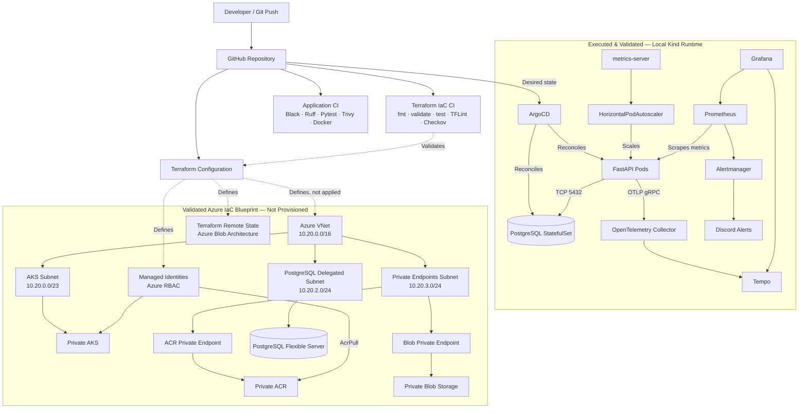

# Cloud-Native SRE & GitOps Platform

A cloud-native SRE and Platform Engineering portfolio project built around a **FastAPI + PostgreSQL workload**, with a focus on automation, reliability, observability, security, GitOps, autoscaling, distributed tracing, resilience testing, and Infrastructure as Code.

The project was built incrementally across seven milestones, with each stage adding and validating another operational capability.

## Technical Demo

[▶ Watch the End-to-End Technical Demo on YouTube](https://www.youtube.com/watch?v=jkMKmUvPHLs)

The demo walks through the CI/CD, Kubernetes, GitOps, observability, autoscaling, distributed tracing, chaos engineering, and Terraform validation implemented in the project.

---

## Project Highlights

### Executed & Validated Runtime

| Area | Result |
|---|---|
| Application tests | **18/18 passing** |
| Statement coverage | **100%** |
| Sustained load test | **29,286 requests / 0 failures** |
| Throughput | **~165 req/s** |
| p95 latency | **~1.2 s** |
| Load-test users | **150 concurrent users** |
| HPA scaling | **2 → 4 → 5 replicas** |
| Pod-kill resilience test | **20,592 requests / 0.09% failure rate** |
| PostgreSQL latency experiment | **~8.7 ms → ~910 ms → ~8.6 ms** |

### Infrastructure as Code Validation

| Area | Result |
|---|---|
| Terraform native tests | **20/20 passing** |
| TFLint | **0 findings** |
| Checkov | **84 passed / 0 failed / 21 documented skips** |
| Azure provisioning | **Intentionally not applied** |

> **Azure deployment status:** The Azure infrastructure is a production-oriented IaC blueprint and has intentionally **not been provisioned**. It is validated through Terraform static validation, native mock tests, TFLint, Checkov, and GitHub Actions CI. The repository does not claim that the Azure architecture is currently deployed.

> The recorded demo shows representative Terraform validation from the `dev` environment. The values above represent the validation results for the complete Terraform codebase.

---

# Architecture

The project has two clearly separated validation boundaries:

- **Local Kind Runtime** — actually executed and operationally validated.
- **Azure IaC Blueprint** — statically validated and mock-tested, but not provisioned.


```mermaid
flowchart TB
    Dev[Developer / Git Push] --> Repo[GitHub Repository]

    %% =========================================================
    %% APPLICATION CI
    %% =========================================================
    Repo --> AppCI[Application CI<br/>Black · Ruff · Pytest · Trivy · Docker]

    %% =========================================================
    %% LOCAL EXECUTED RUNTIME
    %% =========================================================
    subgraph Local["Executed & Validated — Local Kind Runtime"]
        ArgoCD[ArgoCD]

        FastAPI[FastAPI Pods]
        Postgres[(PostgreSQL StatefulSet)]

        MetricsServer[metrics-server]
        HPA[HorizontalPodAutoscaler]

        Prometheus[Prometheus]
        Alertmanager[Alertmanager]
        Grafana[Grafana]

        OTel[OpenTelemetry Collector]
        Tempo[Tempo]

        ArgoCD -->|Reconciles| FastAPI
        ArgoCD -->|Reconciles| Postgres

        MetricsServer --> HPA
        HPA -->|Scales| FastAPI

        FastAPI -->|TCP 5432| Postgres

        Prometheus -->|Scrapes metrics| FastAPI
        Prometheus --> Alertmanager
        Alertmanager --> Discord[Discord Alerts]

        FastAPI -->|OTLP gRPC| OTel
        OTel --> Tempo

        Grafana --> Prometheus
        Grafana --> Tempo
    end

    Repo -->|Desired state| ArgoCD

    %% =========================================================
    %% TERRAFORM CI
    %% =========================================================
    Repo --> IaCCI[Terraform IaC CI<br/>fmt · validate · test · TFLint · Checkov]
    Repo --> Terraform[Terraform Configuration]

    IaCCI -. Validates .-> Terraform

    %% =========================================================
    %% AZURE BLUEPRINT
    %% =========================================================
    subgraph Azure["Validated Azure IaC Blueprint — Not Provisioned"]
        VNet[Azure VNet<br/>10.20.0.0/16]

        AKSSubnet[AKS Subnet<br/>10.20.0.0/23]
        PGSubnet[PostgreSQL Delegated Subnet<br/>10.20.2.0/24]
        PESubnet[Private Endpoints Subnet<br/>10.20.3.0/24]

        AKS[Private AKS]
        ACRPE[ACR Private Endpoint]
        ACR[Private ACR]

        AzurePG[(PostgreSQL Flexible Server)]

        BlobPE[Blob Private Endpoint]
        Blob[Private Blob Storage]

        Identity[Managed Identities<br/>Azure RBAC]
        State[Terraform Remote State<br/>Azure Blob Architecture]

        VNet --> AKSSubnet
        VNet --> PGSubnet
        VNet --> PESubnet

        AKSSubnet --> AKS
        PGSubnet --> AzurePG

        PESubnet --> ACRPE
        ACRPE --> ACR

        PESubnet --> BlobPE
        BlobPE --> Blob

        Identity --> AKS
        Identity -->|AcrPull| ACR
    end

    Terraform -. Defines, not applied .-> VNet
    Terraform -. Defines .-> Identity
    Terraform -. Defines .-> State
```

### Responsibility Boundaries

```text
Terraform  → Azure cloud infrastructure
Helm       → Kubernetes application packaging
ArgoCD     → Kubernetes desired-state reconciliation
```

Keeping these responsibilities separate avoids coupling cloud provisioning with the Kubernetes application lifecycle.

---

# Seven Milestones

All seven planned milestones are complete.

| # | Milestone | Main Outcome | Deep Dive |
|---|---|---|---|
| **1** | CI Pipeline & Container Security | Automated quality gates, testing, Docker build and Trivy scanning | [CI & Security](docs/ci-security.md) |
| **2** | Kubernetes & Helm | Kind runtime, Helm packaging, StatefulSet storage, probes and NetworkPolicies | [Kubernetes & Helm](docs/kubernetes-helm.md) |
| **3** | GitOps | Pull-based delivery with ArgoCD, automated reconciliation and Sealed Secrets | [GitOps with ArgoCD](docs/gitops.md) |
| **4** | Observability & Alerting | Prometheus, Grafana, Alertmanager and validated alert delivery | [Observability & Alerting](docs/observability.md) |
| **5** | Autoscaling & Load Testing | HPA validation, in-cluster Locust testing and resilience experiments | [Load Testing & Resilience](docs/load-testing.md) |
| **6** | Distributed Tracing & Chaos Engineering | OpenTelemetry → Tempo tracing and reproducible PostgreSQL fault injection | [Tracing & Chaos](docs/tracing-chaos.md) |
| **7** | Terraform & Azure | Modular private Azure infrastructure blueprint with dedicated IaC validation | [Terraform & Azure](terraform/README.md) |

---

# Tech Stack

### Application

- Python 3.12
- FastAPI
- Pydantic
- SQLAlchemy
- PostgreSQL

### Containers & Kubernetes

- Docker
- Kubernetes
- Kind
- Helm v3
- StatefulSets
- PersistentVolumeClaims
- NetworkPolicies
- Startup / Liveness / Readiness probes
- HorizontalPodAutoscaler
- metrics-server

### CI/CD & GitOps

- GitHub Actions
- ArgoCD
- Bitnami Sealed Secrets

### Observability

- Prometheus Operator
- kube-prometheus-stack
- Prometheus
- Grafana
- Alertmanager
- kube-state-metrics
- OpenTelemetry
- OpenTelemetry Collector
- OTLP/gRPC
- Tempo

### Testing & Resilience

- Pytest
- Pytest-Cov
- Locust
- Kubernetes-based load testing
- Chaos / resilience testing
- `tc netem`
- Terraform native tests

### Security & Quality

- Trivy
- Ruff
- Black
- TFLint
- Checkov
- Non-root containers
- Read-only root filesystem
- Kubernetes NetworkPolicies

### Infrastructure as Code

- Terraform
- AzureRM Provider
- Azure Virtual Network
- Azure Kubernetes Service
- Azure Container Registry
- Azure Database for PostgreSQL Flexible Server
- Azure Blob Storage
- Azure Private Link
- Azure Private DNS
- Azure Managed Identities
- Azure RBAC

---

# Key Engineering Decisions

## Why ArgoCD instead of deploying Kubernetes directly from GitHub Actions?

A push-based deployment model requires the external CI system to hold credentials that can modify the Kubernetes cluster.

ArgoCD runs inside Kubernetes and pulls the desired state from Git, providing:

- continuous reconciliation
- automated sync
- self-healing
- pruning
- reduced dependency on external Kubernetes deployment credentials

The GitOps flow was validated by changing application configuration in Git and allowing ArgoCD to reconcile the live Deployment without using `kubectl apply`, `helm upgrade`, or a manual ArgoCD sync.

---

## Why separate liveness and readiness?

They answer different operational questions:

```text
Liveness  → Is the application process alive?
Readiness → Can this pod currently serve traffic?
```

The readiness endpoint checks database availability while liveness intentionally does not.

If PostgreSQL becomes unavailable, the FastAPI pod can therefore be removed from service endpoints without repeatedly restarting an otherwise healthy application process.

---

## Why StatefulSet for PostgreSQL?

The local PostgreSQL instance needs stable identity and persistent storage.

A StatefulSet provides:

- stable pod identity
- stable network naming
- persistent volume association
- predictable service discovery

---

## Why run Locust inside Kubernetes?

The original high-concurrency test used `kubectl port-forward` and produced an apparent failure rate of roughly 94%.

Investigation showed that the port-forward transport was introducing an artificial bottleneck.

Locust was moved inside the Kubernetes cluster so requests could reach the FastAPI Service directly.

That exposed the actual application bottlenecks instead:

- restrictive CPU limits
- insufficient database connection-pool capacity
- connection timeout behavior
- an unbounded `GET /users` query

After addressing those issues, the final sustained test completed:

```text
Requests:          29,286
Failures:          0
Failure rate:      0.00%
Throughput:        ~165 req/s
p95 latency:       ~1.2 s
Concurrent users:  150
Duration:          3 minutes
```

---

## Why use GitOps for replica ownership with HPA?

When autoscaling is enabled, the HPA needs to own the Deployment replica count.

The Helm chart therefore does not declare `.spec.replicas` while autoscaling is enabled, and ArgoCD ignores `/spec/replicas`.

This prevents ArgoCD and the HPA from continuously competing over the same field while still allowing GitOps to manage the rest of the Deployment.

---

## Why Terraform + Helm + ArgoCD instead of Terraform managing everything?

Each tool owns a different lifecycle:

```text
Terraform  → cloud infrastructure
Helm       → Kubernetes application packaging
ArgoCD     → Kubernetes reconciliation
```

This keeps ownership boundaries clear and prevents infrastructure changes from becoming tightly coupled to application deployment behavior.

---

## Why is Azure not deployed?

Milestones 1–6 validate a real running Kubernetes environment.

Milestone 7 validates a different layer: the infrastructure definition itself.

```text
Terraform source
      ↓
Formatting
      ↓
Static validation
      ↓
Mock infrastructure tests
      ↓
TFLint
      ↓
Checkov
      ↓
GitHub Actions CI
```

The Azure architecture is therefore presented as a **validated Infrastructure as Code blueprint**, not as a live environment.

---

# Repository Structure

```text
cloud-native-sre-platform/
│
├── .github/
│   └── workflows/
│       ├── ci.yml
│       └── terraform-ci.yml
│
├── app/
│   ├── src/
│   │   ├── config.py
│   │   ├── database.py
│   │   ├── main.py
│   │   ├── metrics.py
│   │   └── tracing.py
│   ├── tests/
│   ├── Dockerfile
│   └── requirements.txt
│
├── charts/
│   └── sre-platform-app/
│
├── argocd/
│
├── monitoring/
│
├── chaos/
│   ├── README.md
│   ├── postgres-latency.ps1
│   └── postgres-outage.ps1
│
├── loadtest/
│
├── terraform/
│   ├── README.md
│   ├── bootstrap/
│   ├── environments/
│   │   └── dev/
│   │       └── tests/
│   └── modules/
│       ├── acr/
│       ├── aks/
│       ├── networking/
│       ├── postgresql/
│       └── storage/
│
├── docs/
│   ├── ci-security.md
│   ├── kubernetes-helm.md
│   ├── gitops.md
│   ├── observability.md
│   ├── load-testing.md
│   └── tracing-chaos.md
│
├── locustfile.py
├── kind-config.yaml
├── pyproject.toml
└── README.md
```

---

# Quick Start

The platform contains several independent components, so each layer can be explored and validated separately.

## Prerequisites

For the application tests:

- Git
- Python
- pip

For the local Kubernetes environment:

- Docker
- kubectl
- Kind
- Helm

For Terraform validation:

- Terraform
- TFLint
- Checkov

---

## 1. Clone the repository

```bash
git clone https://github.com/Konstantinos820/cloud-native-sre-platform.git
cd cloud-native-sre-platform
```

## 2. Create and activate a Python virtual environment

Create the virtual environment from the repository root:

```bash
python -m venv .venv
```

### Windows PowerShell

```powershell
.\.venv\Scripts\Activate.ps1
```

If PowerShell blocks script execution for the current session:

```powershell
Set-ExecutionPolicy -Scope Process -ExecutionPolicy RemoteSigned
.\.venv\Scripts\Activate.ps1
```

### Linux / macOS

```bash
source .venv/bin/activate
```

## 3. Install application and development dependencies

From the repository root:

```bash
pip install -r app/requirements-dev.txt
```

`requirements-dev.txt` also installs the runtime dependencies defined in `requirements.txt`.

## 4. Run the application tests

```bash
cd app
pytest --cov=src --cov-report=term-missing tests/
```

Expected result:

```text
18 passed
175 statements
100% statement coverage
```

Return to the repository root before continuing:

```bash
cd ..
```

## 5. Validate the Helm chart

```bash
helm lint charts/sre-platform-app
helm template sre-platform-app charts/sre-platform-app
```

Both commands should complete without Helm validation or template-rendering errors.

## 6. Create the local Kind cluster

Make sure Docker is running, then create the cluster:

```bash
kind create cluster --config kind-config.yaml
```

Verify that the cluster is available:

```bash
kubectl cluster-info --context kind-kind
kubectl get nodes
```

The complete Kubernetes, GitOps, and monitoring deployment process is documented in:

- [Kubernetes & Helm](docs/kubernetes-helm.md)
- [GitOps with ArgoCD](docs/gitops.md)
- [Observability & Alerting](docs/observability.md)

## 7. Validate the Terraform development environment

From the repository root:

```bash
cd terraform/environments/dev
terraform init -backend=false
terraform validate
terraform test
```

The development environment should pass Terraform validation and its native composition test.

Return to the repository root:

```bash
cd ../../..
```

The complete Terraform codebase is additionally validated with:

```text
terraform fmt
terraform validate
terraform test
TFLint
Checkov
```

The dedicated Infrastructure as Code CI workflow is:

```text
.github/workflows/terraform-ci.yml
```

This validation workflow intentionally uses no Azure credentials and performs no `terraform apply` or live Azure provisioning.

For the complete Azure architecture, Terraform modules, tests, security controls, and validation process, see:

[Terraform & Azure Deep Dive](terraform/README.md)

---

# Deep Dives

Detailed implementation notes are kept outside the root README so this page can remain focused on the overall platform.

### CI & Security
[`docs/ci-security.md`](docs/ci-security.md)

GitHub Actions, Python quality gates, application tests, coverage, Docker hardening and Trivy scanning.

### Kubernetes & Helm
[`docs/kubernetes-helm.md`](docs/kubernetes-helm.md)

Kind, Helm, StatefulSets, persistent storage, health probes, rolling updates, NetworkPolicies and container hardening.

### GitOps with ArgoCD
[`docs/gitops.md`](docs/gitops.md)

Pull-based reconciliation, automated sync, self-healing, pruning, Sealed Secrets and HPA/ArgoCD ownership.

### Observability & Alerting
[`docs/observability.md`](docs/observability.md)

Prometheus, Grafana, ServiceMonitor configuration, custom Prometheus rules, Alertmanager and Discord alert validation.

### Load Testing & Resilience
[`docs/load-testing.md`](docs/load-testing.md)

HPA behavior, Locust methodology, performance bottlenecks, sustained-load results and pod-kill resilience testing.

### Distributed Tracing & Chaos Engineering
[`docs/tracing-chaos.md`](docs/tracing-chaos.md)

OpenTelemetry instrumentation, Collector → Tempo tracing, SQLAlchemy spans, PostgreSQL network latency and dependency-outage experiments.

### Terraform & Azure
[`terraform/README.md`](terraform/README.md)

Private AKS, ACR, PostgreSQL Flexible Server, Blob Storage, private networking, managed identities, RBAC, remote-state architecture and Terraform validation.

### Chaos Experiment Scripts
[`chaos/README.md`](chaos/README.md)

Reproducible PostgreSQL latency and dependency-outage experiments with automatic cleanup.

---

# Project Status

**All seven planned milestones are complete.**

The project currently demonstrates:

- secure application CI
- Docker build and security scanning
- Kubernetes orchestration
- Helm packaging
- persistent PostgreSQL storage
- restrictive network policies
- health and readiness management
- pull-based GitOps
- encrypted Git-managed secrets
- metrics and alerting
- HPA autoscaling
- in-cluster load testing
- performance troubleshooting
- pod failure resilience
- distributed tracing
- controlled dependency fault injection
- automated recovery validation
- modular Azure Terraform infrastructure
- dedicated Infrastructure as Code CI

The local Kubernetes environment has been executed and operationally validated.

The Azure architecture remains intentionally **unprovisioned** and is presented as a validated Infrastructure as Code blueprint rather than a live deployment.
