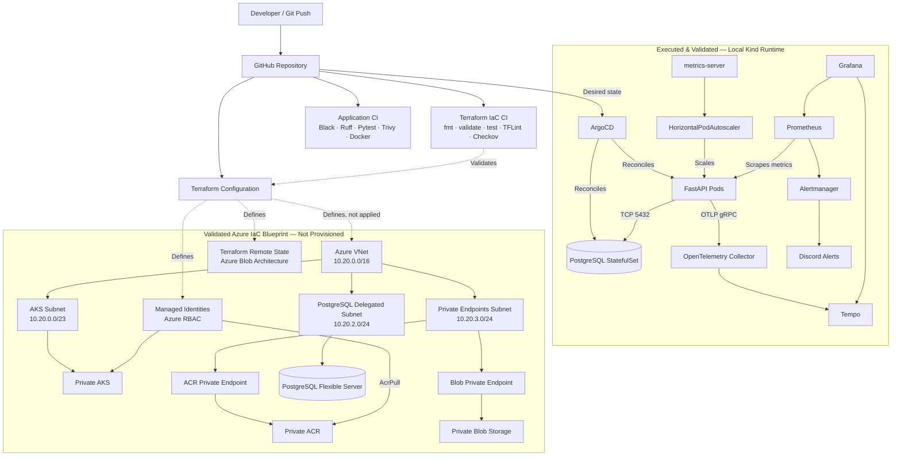

# Cloud-Native SRE & GitOps Platform

A production-oriented SRE portfolio project demonstrating how a cloud-native application platform can be built around **automation, reliability, observability, security, GitOps, autoscaling, distributed tracing, resilience testing, and Infrastructure as Code**.

The project was developed incrementally across seven milestones, with each milestone introducing another layer of operational maturity.

---

## Project Highlights

| Area | Result |
|---|---|
| Application tests | **18/18 passing** |
| Statement coverage | **100%** |
| Sustained load test | **29,286 requests / 0 failures** |
| Throughput | **~165 req/s** |
| p95 latency | **~1.2 s** |
| Load-test users | **150 concurrent users** |
| Pod-kill resilience test | **20,592 requests / 0.09% failure rate** |
| Terraform native tests | **20/20 passing** |
| TFLint | **0 findings** |
| Checkov | **84 passed / 0 failed / 21 documented skips** |

> **Azure deployment status:** The Azure infrastructure defined in Milestone 7 has intentionally **not been provisioned**. It is a production-oriented IaC blueprint validated through Terraform static validation, native mock tests, TFLint, Checkov, and GitHub Actions CI. The repository does not claim that the Azure architecture is currently deployed.

---

# Architecture Overview

The project has two different validation boundaries:

- **Local Kind Runtime** — actually executed and operationally validated.
- **Azure IaC Blueprint** — statically validated and mock-tested, but not provisioned.


```mermaid
flowchart TB
    Dev[Developer / Git Push] --> Repo[GitHub Repository]

    %% =========================================================
    %% APPLICATION CI
    %% =========================================================
    Repo --> AppCI[Application CI<br/>Black · Ruff · Pytest · Trivy · Docker]

    %% =========================================================
    %% LOCAL EXECUTED RUNTIME
    %% =========================================================
    subgraph Local["Executed & Validated — Local Kind Runtime"]
        ArgoCD[ArgoCD]

        FastAPI[FastAPI Pods]
        Postgres[(PostgreSQL StatefulSet)]

        MetricsServer[metrics-server]
        HPA[HorizontalPodAutoscaler]

        Prometheus[Prometheus]
        Alertmanager[Alertmanager]
        Grafana[Grafana]

        OTel[OpenTelemetry Collector]
        Tempo[Tempo]

        ArgoCD -->|Reconciles| FastAPI
        ArgoCD -->|Reconciles| Postgres

        MetricsServer --> HPA
        HPA -->|Scales| FastAPI

        FastAPI -->|TCP 5432| Postgres

        Prometheus -->|Scrapes metrics| FastAPI
        Prometheus --> Alertmanager
        Alertmanager --> Discord[Discord Alerts]

        FastAPI -->|OTLP gRPC| OTel
        OTel --> Tempo

        Grafana --> Prometheus
        Grafana --> Tempo
    end

    Repo -->|Desired state| ArgoCD

    %% =========================================================
    %% TERRAFORM CI
    %% =========================================================
    Repo --> IaCCI[Terraform IaC CI<br/>fmt · validate · test · TFLint · Checkov]
    Repo --> Terraform[Terraform Configuration]

    IaCCI -. Validates .-> Terraform

    %% =========================================================
    %% AZURE BLUEPRINT
    %% =========================================================
    subgraph Azure["Validated Azure IaC Blueprint — Not Provisioned"]
        VNet[Azure VNet<br/>10.20.0.0/16]

        AKSSubnet[AKS Subnet<br/>10.20.0.0/23]
        PGSubnet[PostgreSQL Delegated Subnet<br/>10.20.2.0/24]
        PESubnet[Private Endpoints Subnet<br/>10.20.3.0/24]

        AKS[Private AKS]
        ACRPE[ACR Private Endpoint]
        ACR[Private ACR]

        AzurePG[(PostgreSQL Flexible Server)]

        BlobPE[Blob Private Endpoint]
        Blob[Private Blob Storage]

        Identity[Managed Identities<br/>Azure RBAC]
        State[Terraform Remote State<br/>Azure Blob Architecture]

        VNet --> AKSSubnet
        VNet --> PGSubnet
        VNet --> PESubnet

        AKSSubnet --> AKS
        PGSubnet --> AzurePG

        PESubnet --> ACRPE
        ACRPE --> ACR

        PESubnet --> BlobPE
        BlobPE --> Blob

        Identity --> AKS
        Identity -->|AcrPull| ACR
    end

    Terraform -. Defines, not applied .-> VNet
    Terraform -. Defines .-> Identity
    Terraform -. Defines .-> State
```

### Responsibility Boundaries

```text
Terraform  → Azure cloud infrastructure
Helm       → Kubernetes application packaging
ArgoCD     → Kubernetes desired-state reconciliation
```

This separation prevents cloud provisioning and Kubernetes application lifecycle management from becoming tightly coupled.

The complete Terraform architecture and design rationale are documented in [`terraform/README.md`](terraform/README.md).

---

# Project Roadmap

All seven planned milestones are complete.

- **1: CI Pipeline & Docker Containerization with Security Scanning** — 🟢 **Completed**
- **2: Local Kubernetes Orchestration & Helm Packaging** — 🟢 **Completed**
- **3: GitOps Continuous Delivery with ArgoCD & Sealed Secrets** — 🟢 **Completed**
- **4: Observability & Production-Grade Alerting** — 🟢 **Completed**
- **5: Autoscaling & Load Testing** — 🟢 **Completed**
- **6: Distributed Tracing & Chaos Engineering** — 🟢 **Completed**
- **7: Infrastructure as Code with Terraform & Azure** — 🟢 **Completed**

---

# Tech Stack

### Application

- Python 3.12
- FastAPI
- Pydantic
- SQLAlchemy
- PostgreSQL

### Kubernetes & Packaging

- Kubernetes
- Kind
- Helm v3
- StatefulSets
- NetworkPolicies
- Startup / Liveness / Readiness probes
- HorizontalPodAutoscaler
- metrics-server

### GitOps

- ArgoCD
- Bitnami Sealed Secrets

### Observability

- Prometheus Operator
- kube-prometheus-stack
- Prometheus
- Grafana
- Alertmanager
- kube-state-metrics
- OpenTelemetry
- OpenTelemetry Collector
- OTLP/gRPC
- Tempo

### Testing & Resilience

- Pytest
- Pytest-Cov
- Locust
- Kubernetes-based load testing
- Chaos / resilience testing
- Terraform native tests

### CI/CD & Security

- GitHub Actions
- Docker
- Multi-stage Docker builds
- Trivy
- Ruff
- Black
- TFLint
- Checkov

### Infrastructure as Code

- Terraform
- AzureRM Provider
- Azure Virtual Network
- Azure Kubernetes Service
- Azure Container Registry
- Azure Database for PostgreSQL Flexible Server
- Azure Blob Storage
- Azure Private Link
- Azure Private DNS
- Azure Managed Identities
- Azure RBAC

---

# Milestone 1 — Secure CI/CD Pipeline

The first milestone established the automated delivery and security foundation.

### Application quality gates

Every change is validated through:

```text
Black
Ruff
Pytest
Pytest-Cov
```

### Containerization

The FastAPI application uses a multi-stage Docker build based on:

```text
python:3.12-slim-bookworm
```

The final runtime container:

- runs as a non-root user
- contains only runtime dependencies
- is scanned before being accepted by CI

### Security scanning

Trivy performs:

- filesystem vulnerability scanning
- secret detection
- dependency vulnerability scanning
- container image vulnerability scanning

The application and container CI workflow is defined in:

```text
.github/workflows/ci.yml
```

---

# Milestone 2 — Kubernetes & Helm

The application was moved into a local Kubernetes environment using Kind.

### Helm

The application is packaged as a Helm chart with configuration separated through `values.yaml`.

### PostgreSQL

PostgreSQL runs as a StatefulSet with:

- stable pod identity
- persistent storage
- dedicated PVC
- stable service discovery

### NetworkPolicies

Database ingress follows a default-deny model.

Only the FastAPI application is allowed to reach PostgreSQL on:

```text
TCP/5432
```

### Health probes

The application exposes separate operational endpoints:

```text
/health/startup
/health/live
/health/ready
```

The readiness probe checks database availability while the liveness probe intentionally does not.

A database outage therefore removes unhealthy application pods from traffic without unnecessarily restarting the application process.

### Rolling updates

The FastAPI Deployment uses:

```text
maxSurge:       25%
maxUnavailable: 0
```

ensuring replacement pods become ready before existing replicas are removed.

---

# Milestone 3 — GitOps with ArgoCD

ArgoCD replaces manual Kubernetes deployment operations with pull-based reconciliation.

```text
Developer
    ↓
Git Push
    ↓
GitHub
    ↓
ArgoCD detects desired-state change
    ↓
Helm rendering
    ↓
Kubernetes reconciliation
```

ArgoCD uses:

```text
automated sync
selfHeal: true
prune: true
```

A replica-count change was validated by modifying Git and allowing ArgoCD to reconcile the cluster without running `kubectl apply` or `helm upgrade` manually.

### Sealed Secrets

Sensitive PostgreSQL credentials are not committed to Git as plaintext.

Bitnami Sealed Secrets stores encrypted secret manifests that can only be decrypted by the controller running inside the Kubernetes cluster.

---

# Milestone 4 — Observability & Alerting

The platform uses `kube-prometheus-stack` for metrics and alerting.

### Application metrics

FastAPI exposes Prometheus metrics covering:

- HTTP requests
- latency
- HTTP errors
- user-registration activity

### Custom alerts

Five custom Prometheus rules were implemented:

```text
FastAPIHighErrorRate
FastAPIPodDown
FastAPIHighLatency
PostgresDown
FastAPIPodRestarting
```

### Alert lifecycle

```text
Application / Kubernetes
        ↓
Prometheus
        ↓
PrometheusRule
        ↓
Alertmanager
        ↓
Discord
```

Alertmanager credentials are managed through Sealed Secrets rather than plaintext configuration stored in Git.

---

# Milestone 5 — Autoscaling, Load Testing & Resilience

## Horizontal Pod Autoscaler

The FastAPI application uses Kubernetes `autoscaling/v2`.

```text
Minimum replicas: 2
Maximum replicas: 5
CPU target:       50%
```

During load testing, the application scaled:

```text
2
↓
4
↓
5 replicas
```

and returned to its minimum replica count after load stopped.

---

## Load Testing

The first high-concurrency test was executed through `kubectl port-forward` and produced an apparent failure rate of approximately:

```text
94%
```

Investigation showed that the bottleneck was the port-forward transport itself rather than the application.

Locust was moved inside the Kubernetes cluster so traffic could reach the Service directly.

The first genuine in-cluster load test then exposed real application bottlenecks:

- restrictive CPU limits
- insufficient database connection-pool capacity
- connection timeout behavior
- an unbounded `GET /users` query

After addressing the root causes, the final test produced:

```text
Requests:          29,286
Failures:          0
Failure rate:      0.00%
Throughput:        ~165 req/s
p95 latency:       ~1.2 s
Concurrent users:  150
Duration:          3 minutes
```

This demonstrated stable application behavior under sustained load.

---

## Pod-Kill Resilience Test

A live FastAPI pod was forcefully terminated during sustained traffic.

Observed result:

```text
Requests:      20,592
Failed:        18
Failure rate:  0.09%
```

Failures were isolated to the short interval surrounding pod termination.

Kubernetes recreated the failed pod automatically while the remaining replicas continued serving traffic.

---

# Milestone 6 — Distributed Tracing & Chaos Engineering

Milestone 6 extended observability from metrics and alerts into request-level distributed tracing and controlled failure experimentation.

---

## OpenTelemetry

The FastAPI application is instrumented with:

- OpenTelemetry API
- OpenTelemetry SDK
- FastAPI instrumentation
- SQLAlchemy instrumentation
- OTLP/gRPC exporter

Tracing pipeline:

```text
FastAPI / SQLAlchemy
        ↓
OTLP/gRPC
        ↓
OpenTelemetry Collector
        ↓
Tempo
        ↓
Grafana
```

Health and metrics endpoints are excluded from automatic tracing to reduce unnecessary telemetry noise.

---

## End-to-End Trace Validation

Real Kubernetes traffic was inspected through Grafana and Tempo.

A database-backed `GET /users` request produced a trace similar to:

```text
GET /users
│
├── connect
├── SELECT app_db
├── http send
├── http send
└── http send
```

Database spans included PostgreSQL attributes such as:

```text
db.system = postgresql
db.name   = app_db
db.user   = app_user
```

Parent-child relationships between the FastAPI server span and SQLAlchemy client spans were validated using real trace data.

---

## Application Test Coverage

```text
18 tests passed
175 statements
175 statements covered
100% statement coverage
```

Coverage includes:

```text
src/config.py       100%
src/database.py     100%
src/main.py         100%
src/metrics.py      100%
src/tracing.py      100%
TOTAL               100%
```

> 100% statement coverage and end-to-end tracing are separate validation signals. The former validates tested code paths; the latter was validated against the running Kubernetes platform.

---

## Chaos Engineering

Reproducible PowerShell experiments are stored under:

```text
chaos/
├── postgres-latency.ps1
├── postgres-outage.ps1
└── README.md
```

Fault injection uses Linux networking primitives:

```text
tc / netem
iptables
nsenter
```

Runtime identifiers are discovered dynamically rather than being hardcoded.

Both experiments include automatic cleanup.

---

### PostgreSQL Latency Experiment

Injected fault:

```text
tc netem delay 300ms
```

Baseline:

```text
5/5 requests successful
Average: 8.67 ms
Median:  8.57 ms
```

During fault:

```text
5/5 requests successful
Average: 910.47 ms
Median:  910.30 ms
```

The experiment caused approximately a **105x increase in observed request latency**.

After cleanup:

```text
5/5 requests successful
Average: 8.64 ms
Median:  8.53 ms
```

No application restart was required.

---

### PostgreSQL Dependency Outage

The experiment blocked FastAPI-to-PostgreSQL communication on TCP/5432.

Observed behavior:

```text
Database requests failed
        ↓
Readiness checks failed
        ↓
FastAPI replicas became NotReady
        ↓
Application processes remained alive
        ↓
Fault was removed
        ↓
Service recovered automatically
```

During the outage:

```text
Requests:               5/5 failed
Ready FastAPI replicas: 0
FastAPI restarts:       0
PostgreSQL:             1/1 Running
```

Tempo captured the failed PostgreSQL connection span and SQLAlchemy `OperationalError`.

After cleanup:

```text
Recovery requests: 5/5 successful
FastAPI replicas:  2 ready
FastAPI restarts:  0
PostgreSQL:        1/1
```

This demonstrated observable dependency failure, correct readiness behavior, automatic cleanup, and recovery without restarting the application.

---

# Milestone 7 — Infrastructure as Code with Terraform & Azure

Milestone 7 adds a reusable Azure Infrastructure as Code layer while preserving the responsibility boundary between Terraform, Helm, and ArgoCD.

> **Important:** The Azure infrastructure is a validated blueprint and has not been provisioned.

---

## Terraform Structure

```text
terraform/
├── README.md
├── bootstrap/
├── environments/
│   └── dev/
│       └── tests/
└── modules/
    ├── acr/
    ├── aks/
    ├── networking/
    ├── postgresql/
    └── storage/
```

The development environment composes reusable modules for:

```text
Networking
Azure Container Registry
Azure Kubernetes Service
PostgreSQL Flexible Server
Azure Blob Storage
```

---

## Azure Network Architecture

VNet:

```text
10.20.0.0/16
```

Subnets:

```text
AKS                 10.20.0.0/23
PostgreSQL          10.20.2.0/24
Private Endpoints   10.20.3.0/24
```

Dedicated NSGs are associated with all three subnets.

### PostgreSQL NSG

Explicit east-west rules enforce:

```text
ALLOW  AKS subnet        → PostgreSQL TCP/5432
ALLOW  PostgreSQL subnet → PostgreSQL TCP/5432
DENY   other VNet traffic → PostgreSQL subnet
```

The PostgreSQL self-subnet rule preserves Flexible Server communication inside the delegated subnet.

### Private Endpoint NSG

```text
ALLOW  AKS subnet         → Private Endpoints TCP/443
DENY   other VNet traffic → Private Endpoints subnet
```

The AKS NSG intentionally avoids a blanket inbound deny rule.

Workload-level isolation inside Kubernetes remains the responsibility of Cilium/Kubernetes Network Policies.

---

## Azure Container Registry

The registry baseline includes:

```text
Premium SKU
Admin account disabled
Public network access disabled
Dedicated data endpoint enabled
30-day untagged manifest retention
Private Endpoint
Private DNS
```

Private DNS:

```text
privatelink.azurecr.io
```

AKS pulls images using managed identity and the `AcrPull` role rather than registry administrator credentials.

---

## Private AKS

AKS security and operational controls include:

```text
Private cluster
Public API FQDN disabled
Local accounts disabled
Azure RBAC
Kubernetes RBAC
Azure Policy
OIDC issuer
Workload Identity
Azure CNI Overlay
Cilium dataplane
Cilium network policy
Automatic patch upgrades
NodeImage OS upgrades
Secrets Store CSI rotation
```

### System Node Pool

```text
VM:            Standard_D4ds_v5
Autoscaling:   2 → 5
Max pods:      110
OS disk:       Ephemeral / 60 GB
Public IP:     Disabled
```

The system pool is reserved for critical Kubernetes workloads.

### Application Node Pool

```text
VM:            Standard_D2ds_v5
Autoscaling:   1 → 3
Max pods:      110
OS disk:       Ephemeral / 60 GB
Public IP:     Disabled
```

---

## Managed Identity & RBAC

AKS uses two explicit User Assigned Managed Identities:

```text
Control Plane Identity
Kubelet Identity
```

RBAC relationships:

```text
Control Plane Identity
    ├── Network Contributor → AKS subnet
    └── Managed Identity Operator → Kubelet identity

Kubelet Identity
    └── AcrPull → Azure Container Registry
```

Using explicit identities produces deterministic Terraform dependencies rather than relying on an implicitly generated kubelet identity.

---

## PostgreSQL Flexible Server

The managed PostgreSQL blueprint uses:

```text
PostgreSQL version:     16
SKU:                    B_Standard_B1ms
Storage:                32 GB
Backup retention:       7 days
Public network access:  Disabled
Private VNet integration
Delegated subnet
Private DNS
```

The application database uses:

```text
Name:       app_db
Charset:    UTF8
Collation:  en_US.utf8
```

The administrator password is modeled as a sensitive and ephemeral Terraform input and supplied through the provider's write-only password attribute.

Lifecycle protection is applied to stateful database resources.

---

## Private Blob Storage

Application object storage includes:

```text
StorageV2
Standard tier
ZRS
HTTPS only
TLS 1.2
Public network access disabled
Shared Key authorization disabled
OAuth authentication by default
Infrastructure encryption
Blob versioning
14-day deletion retention
Private container
Private Endpoint
Private DNS
```

Private DNS:

```text
privatelink.blob.core.windows.net
```

---

## Terraform Remote State

A separate bootstrap configuration defines the Azure Blob backend architecture.

It includes:

```text
Resource Group
Storage Account
Private tfstate container
Blob versioning
Soft-delete protection
Microsoft Entra RBAC
Storage Blob Data Contributor
Shared Key disabled
```

The bootstrap configuration necessarily begins with local Terraform state.

The development environment includes:

```text
backend.hcl.example
```

while the actual:

```text
backend.hcl
```

is excluded from Git.

A public backend endpoint can be enabled for GitHub-hosted runners while still requiring Microsoft Entra authentication and keeping Shared Key authorization disabled.

A private runner environment could move the backend behind Private Link.

---

## Terraform Native Tests

Terraform native tests use mock providers and deterministic overrides.

No Azure credentials or Azure API calls are required.

All test runs use planning behavior rather than infrastructure provisioning.

Current coverage:

```text
ACR              3
AKS              3
Networking       6
PostgreSQL       4
Storage          3
Dev Composition  1
──────────────────
TOTAL           20
```

Result:

```text
20 passed
0 failed
```

The tests validate important infrastructure invariants such as:

- private AKS controls
- separate system and application node pools
- managed identity relationships
- network segmentation
- PostgreSQL delegation
- explicit NSG rules
- Private Endpoint policy enforcement
- ACR private connectivity
- Storage security controls
- root environment composition

These tests do **not** replace a real Azure deployment test.

---

## Terraform Quality Gates

The complete Terraform codebase passes:

```text
terraform fmt
terraform validate
terraform test
TFLint
Checkov
```

Current result:

```text
Terraform tests: 20/20 passed
TFLint:          0 findings

Checkov:
  Passed:        84
  Failed:        0
  Skipped:       21
```

Checkov skips are documented inline rather than silently ignored.

Examples include controls related to:

- paid AKS SLA
- host encryption
- customer-managed encryption keys
- multi-region ACR
- PostgreSQL geo-redundant backups
- Azure Monitor integration
- private Terraform backend runner connectivity

These represent deployment-specific production hardening, compliance, availability, or cost decisions rather than hidden failures in the baseline.

---

## Dedicated Terraform CI

Infrastructure validation has its own workflow:

```text
.github/workflows/terraform-ci.yml
```

The pipeline contains three independent jobs:

```text
Terraform Validate & Test
TFLint
Checkov Security Scan
```

Terraform CI performs:

```text
terraform fmt -check
terraform init -backend=false
terraform validate
terraform test
```

The workflow deliberately contains no:

```text
Azure credentials
az login
Azure OIDC authentication
terraform apply
live Azure provisioning
```

This makes the workflow an offline IaC quality gate rather than a deployment pipeline.

---

## Validation Boundary

Milestones 1–6 validate a real running environment:

```text
Kubernetes
GitOps
Metrics
Alerting
Autoscaling
Load behavior
Distributed tracing
Chaos experiments
Recovery behavior
```

Milestone 7 validates a different layer:

```text
Terraform source
      ↓
Formatting
      ↓
Static validation
      ↓
Mock infrastructure tests
      ↓
TFLint
      ↓
Checkov
      ↓
GitHub Actions CI
```

The project therefore demonstrates:

```text
Executed & Validated Local Runtime
                +
Validated Azure Infrastructure Blueprint
```

without presenting unprovisioned Azure infrastructure as a live deployment.

For the full Infrastructure as Code deep dive, see [`terraform/README.md`](terraform/README.md).

---

# CI Workflows

The repository deliberately separates application and infrastructure validation.

```text
.github/workflows/
├── ci.yml
└── terraform-ci.yml
```

### `ci.yml`

Validates:

```text
Python formatting
Python linting
Application tests
Coverage
Filesystem security scanning
Docker build
Container image security scanning
```

### `terraform-ci.yml`

Validates:

```text
Terraform formatting
Terraform configuration
Terraform native tests
TFLint
Checkov
```

This keeps application delivery concerns separate from Infrastructure as Code validation.

---

# Key Engineering Decisions

### Why ArgoCD instead of deploying Kubernetes directly from GitHub Actions?

A push-based model requires CI to hold Kubernetes credentials.

ArgoCD runs inside the cluster and pulls desired state from Git, providing:

- continuous reconciliation
- self-healing
- pruning
- reduced dependency on external deployment credentials

---

### Why separate liveness and readiness?

They answer different questions.

```text
Liveness  → Is the application process alive?
Readiness → Can this pod currently serve traffic?
```

A database outage should remove the pod from service endpoints without repeatedly restarting a healthy application process.

---

### Why StatefulSet for local PostgreSQL?

PostgreSQL requires stable identity and persistent storage.

A StatefulSet provides:

- stable pod identity
- stable network naming
- persistent volume association

---

### Why was Locust moved into the cluster?

The original test path through `kubectl port-forward` introduced an artificial bottleneck.

Moving Locust inside Kubernetes allowed the test to measure the real application-to-Service path.

---

### Why Terraform + Helm + ArgoCD instead of Terraform managing everything?

Each tool owns a different lifecycle:

```text
Terraform  → cloud infrastructure
Helm       → Kubernetes packaging
ArgoCD     → Kubernetes reconciliation
```

This produces cleaner ownership boundaries and avoids tightly coupling infrastructure changes to application deployment behavior.

---

# Repository Structure

Only the most important directories are shown.

```text
cloud-native-sre-platform/
│
├── .github/
│   └── workflows/
│       ├── ci.yml
│       └── terraform-ci.yml
│
├── app/
│   ├── src/
│   │   ├── config.py
│   │   ├── database.py
│   │   ├── main.py
│   │   ├── metrics.py
│   │   └── tracing.py
│   ├── tests/
│   ├── Dockerfile
│   └── requirements.txt
│
├── charts/
│   └── sre-platform-app/
│
├── argocd/
│
├── monitoring/
│
├── chaos/
│   ├── README.md
│   ├── postgres-latency.ps1
│   └── postgres-outage.ps1
│
├── loadtest/
│
├── terraform/
│   ├── README.md
│   ├── bootstrap/
│   ├── environments/
│   │   └── dev/
│   │       └── tests/
│   └── modules/
│       ├── acr/
│       ├── aks/
│       ├── networking/
│       ├── postgresql/
│       └── storage/
│
├── locustfile.py
├── kind-config.yaml
├── pyproject.toml
└── README.md
```

---

# Current Status

## All Seven Milestones Completed

The platform now includes:

- secure application CI
- container security scanning
- Kubernetes orchestration
- Helm packaging
- GitOps reconciliation
- encrypted secrets
- metrics and production-style alerting
- autoscaling
- in-cluster load testing
- performance root-cause analysis
- pod failure resilience testing
- distributed tracing
- reproducible dependency chaos experiments
- automated recovery validation
- modular Azure Terraform infrastructure
- private AKS architecture
- managed identities and RBAC
- managed PostgreSQL private networking
- private ACR and Blob Storage
- explicit NSG segmentation
- remote Terraform state architecture
- offline Terraform infrastructure tests
- dedicated IaC CI

Validated results:

```text
Application tests:      18/18
Statement coverage:     100%

Terraform tests:        20/20
TFLint findings:        0
Checkov failures:       0
Checkov passed checks:  84
```

The Azure architecture remains intentionally **unprovisioned** and is described as a validated Infrastructure as Code blueprint rather than a live environment.

---

# Project Objective

The project demonstrates a complete SRE-oriented engineering lifecycle:

```text
Code
 ↓
CI
 ↓
Security Scanning
 ↓
Docker
 ↓
Kubernetes
 ↓
Helm
 ↓
GitOps
 ↓
Observability
 ↓
Alerting
 ↓
Autoscaling
 ↓
Load Testing
 ↓
Distributed Tracing
 ↓
Chaos Engineering
 ↓
Infrastructure as Code
```

The emphasis throughout the project is on **measurable reliability, reproducibility, automation, failure investigation, security, and operational correctness** rather than simply deploying a containerized application.
