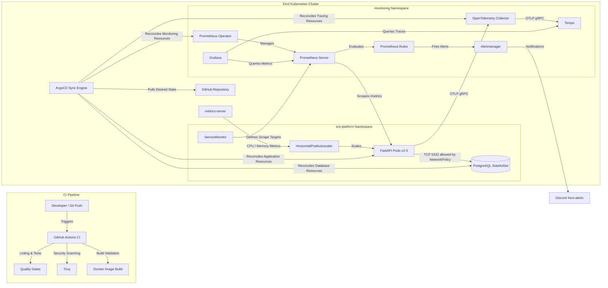

# Cloud-Native SRE & GitOps Platform

Welcome to my enterprise-grade SRE portfolio project.

This repository is a mono-repo designed to demonstrate how a production-oriented cloud-native platform can be built around **automation, reliability, observability, security, GitOps, autoscaling, testing, distributed tracing, and infrastructure as code**.

The project is intentionally built incrementally, with every milestone introducing another layer of operational maturity.

---

## Architecture Diagram


```mermaid
graph LR
    %% =========================================================
    %% CI
    %% =========================================================
    subgraph CI [CI Pipeline]
        Dev[Developer / Git Push] -->|Triggers| GHA[GitHub Actions CI]

        GHA -->|Linting & Tests| Quality[Quality Gates]
        GHA -->|Security Scanning| Trivy[Trivy]
        GHA -->|Build Validation| DockerBuild[Docker Image Build]
    end

    %% =========================================================
    %% External Git Repository
    %% =========================================================
    GitRepo[GitHub Repository]

    %% =========================================================
    %% Kubernetes Cluster
    %% =========================================================
    subgraph Cluster [Kind Kubernetes Cluster]

        %% -----------------------------------------------------
        %% GitOps
        %% -----------------------------------------------------
        ArgoCD[ArgoCD Sync Engine]
        ArgoCD -->|Pulls Desired State| GitRepo

        %% -----------------------------------------------------
        %% Application Namespace
        %% -----------------------------------------------------
        subgraph SRE_NS [sre-platform Namespace]

            FastAPI[FastAPI Pods x2-5]
            Postgres[(PostgreSQL StatefulSet)]

            HPA[HorizontalPodAutoscaler]
            ServiceMonitor[ServiceMonitor]

            HPA -->|Scales| FastAPI
            FastAPI -->|TCP 5432 allowed by NetworkPolicy| Postgres
        end

        %% -----------------------------------------------------
        %% Cluster-level Components
        %% -----------------------------------------------------
        MetricsServer[metrics-server] -->|CPU / Memory Metrics| HPA

        %% -----------------------------------------------------
        %% Monitoring Namespace
        %% -----------------------------------------------------
        subgraph Mon_NS [monitoring Namespace]

            PromOperator[Prometheus Operator]
            Prometheus[Prometheus Server]
            Rules[Prometheus Rules]
            Alertmanager[Alertmanager]

            OTelCollector[OpenTelemetry Collector]
            Tempo[Tempo]
            Grafana[Grafana]

            PromOperator -->|Manages| Prometheus

            ServiceMonitor -->|Defines Scrape Targets| Prometheus
            Prometheus -->|Scrapes /metrics| FastAPI

            Prometheus -->|Evaluates| Rules
            Rules -->|Fires Alerts| Alertmanager

            Grafana -->|Queries Metrics| Prometheus

            FastAPI -->|OTLP gRPC| OTelCollector
            OTelCollector -->|OTLP gRPC| Tempo
            Grafana -->|Queries Traces| Tempo
        end

        %% -----------------------------------------------------
        %% GitOps Reconciliation
        %% -----------------------------------------------------
        ArgoCD -->|Reconciles Application Resources| FastAPI
        ArgoCD -->|Reconciles Database Resources| Postgres
        ArgoCD -->|Reconciles Monitoring Resources| PromOperator
        ArgoCD -->|Reconciles Tracing Resources| OTelCollector
    end

    %% =========================================================
    %% External Notifications
    %% =========================================================
    Alertmanager -->|Notifications| Discord[Discord #sre-alerts]
```

---

# Project Roadmap

The platform is being implemented through seven progressive SRE milestones:

* **1: CI Pipeline & Docker Containerization with Security Scanning** 🟢 **Completed**
* **2: Local Kubernetes Orchestration & Helm Packaging** 🟢 **Completed**
* **3: GitOps Continuous Delivery with ArgoCD & Sealed Secrets** 🟢 **Completed**
* **4: Observability & Production-Grade Alerting** 🟢 **Completed**
* **5: Autoscaling & Load Testing** 🟢 **Completed**
* **6: Distributed Tracing & Chaos Engineering** 🟢 **Completed**
* **7: Infrastructure as Code with Terraform** ⏳ **Planned**

---

# 🛠️ Tech Stack & SRE Tooling

### Application

* FastAPI
* Python 3.12
* Pydantic
* SQLAlchemy
* PostgreSQL

### Kubernetes & Packaging

* Kubernetes
* Kind
* Helm v3
* Kubernetes StatefulSets
* Kubernetes NetworkPolicies
* Kubernetes Probes
* Kubernetes HPA
* metrics-server

### GitOps

* ArgoCD
* Bitnami Sealed Secrets

### Observability

* Prometheus Operator
* kube-prometheus-stack
* Prometheus
* Grafana
* Alertmanager
* kube-state-metrics
* prometheus_client
* OpenTelemetry
* OpenTelemetry Collector
* OTLP/gRPC
* Tempo

### Testing & Load Engineering

* Pytest
* Pytest-Cov
* Locust
* Kubernetes-based load testing
* Chaos / resilience testing

### CI/CD & Security

* GitHub Actions
* Docker
* Multi-stage Docker builds
* Trivy
* Ruff
* Black

### Planned Infrastructure

* Terraform
* tflint
* Checkov

---

# 🟢 Milestone 1: Secure CI/CD Pipeline

The first phase establishes the automated software delivery and security foundation.

## 1. Code Quality & Testing

Every change is validated through automated quality gates.

* Ruff linting
* Black formatting
* Pytest
* Pytest-Cov
* Automated test execution in CI

## 2. Multi-stage Docker Builds

The application is packaged using a multi-stage Docker build based on:

`python:3.12-slim-bookworm`

The final container runs as a **non-root user** and contains only the dependencies required to run the application.

## 3. Supply-Chain Security

Trivy is executed directly inside the GitHub Actions pipeline.

The CI pipeline performs:

* Filesystem vulnerability scanning
* Secret detection
* Dependency vulnerability scanning
* Container image vulnerability scanning

The pipeline uses `--ignore-unfixed` so vulnerabilities without an available upstream fix do not unnecessarily block delivery.

> **SRE Implementation Note:** Using the native Trivy CLI instead of depending exclusively on a third-party GitHub Action gives the project greater control over the security scanning environment and makes the same scanner usable locally by developers.

---

# 🟢 Milestone 2: Local Kubernetes & Helm Packaging

The second phase moves the application from a containerized service into a Kubernetes environment.

## 1. Kind Kubernetes Cluster

A local Kubernetes cluster is provisioned using Kind.

The cluster configuration includes the networking and port mappings required for the platform.

## 2. Helm Packaging

The application infrastructure is packaged using Helm v3.

The Helm chart contains the core Kubernetes resources required to run the platform.

Configuration is separated from templates through `values.yaml`.

## 3. PostgreSQL StatefulSet

PostgreSQL runs as a Kubernetes StatefulSet.

This provides:

* Stable pod identity
* Persistent storage
* Dedicated PVC
* Stable database networking

A Headless Service provides DNS-based discovery for the PostgreSQL pod.

## 4. Network Policies

A default-deny database ingress policy is enforced.

Only the FastAPI application pods are explicitly allowed to connect to PostgreSQL on port `5432`.

## 5. Kubernetes Health Probes

The application exposes separate endpoints for different operational concerns:

### Startup

`/health/startup`

Allows the application time to initialize before other probes become relevant.

### Liveness

`/health/live`

Determines whether the application process itself is alive.

The database is intentionally not checked here.

### Readiness

`/health/ready`

Performs an active database connectivity check.

If PostgreSQL becomes unavailable, Kubernetes removes the pod from service endpoints instead of unnecessarily restarting the application.

## 6. Rolling Updates

The FastAPI Deployment uses a `RollingUpdate` strategy with:

* `maxSurge: 25%`
* `maxUnavailable: 0`

This ensures new pods become ready before existing pods are removed.

---

# 🟢 Milestone 3: GitOps Continuous Delivery

The third phase replaces manual Kubernetes deployment operations with a pull-based GitOps workflow.

## 1. ArgoCD

ArgoCD runs inside the Kubernetes cluster and continuously watches the Git repository.

The deployment flow is:

```text
Developer
   ↓
Git Push
   ↓
GitHub
   ↓
ArgoCD detects change
   ↓
Helm rendering
   ↓
Kubernetes reconciliation
```

ArgoCD is configured with:

* Automated synchronization
* `selfHeal: true`
* `prune: true`

This means Kubernetes state is continuously reconciled against Git.

### Verified

FastAPI replica scaling was performed by changing `replicaCount` in `values.yaml` and pushing the change to Git.

No manual `kubectl` or `helm upgrade` command was required.

## 2. Sealed Secrets

PostgreSQL credentials are never stored as plaintext in Git.

Bitnami Sealed Secrets is used to encrypt Kubernetes secrets client-side.

The encrypted `SealedSecret` can safely exist in the Git repository while only the controller inside the cluster can decrypt it.

---

# 🟢 Milestone 4: Observability & Production-Grade Alerting

The fourth phase introduces metrics collection, alerting, and operational visibility.

## 1. Prometheus Operator

The platform uses `kube-prometheus-stack`.

Prometheus automatically discovers application metrics through Kubernetes `ServiceMonitor` resources.

The configuration was tuned to discover custom `PrometheusRule` resources across namespaces.

## 2. Application Metrics

The FastAPI application exposes Prometheus metrics including:

* HTTP request metrics
* Request latency
* HTTP error rates
* User registration metrics

## 3. Custom SRE Alerts

Five custom alerting rules were implemented:

### FastAPIHighErrorRate

Triggers when HTTP 5xx errors exceed the defined threshold.

### FastAPIPodDown

Detects when the FastAPI Prometheus target becomes unavailable.

### FastAPIHighLatency

Detects elevated request latency using percentile-based measurements.

### PostgresDown

Uses Kubernetes state metrics to detect PostgreSQL pod readiness failures.

### FastAPIPodRestarting

Detects unexpected container restarts.

## 4. Alertmanager

Alertmanager handles alert routing and notification delivery.

Alerts are routed to a dedicated Discord channel.

The complete alert lifecycle was validated:

```text
Application / Kubernetes
        ↓
Prometheus
        ↓
PrometheusRule
        ↓
Alertmanager
        ↓
Discord
```

## 5. GitOps-Compliant Alertmanager Credentials

The Discord webhook configuration is encrypted using Sealed Secrets.

Sensitive webhook credentials are therefore not stored as plaintext in Git.

---

# 🟢 Milestone 5: Autoscaling & Load Testing

The fifth phase validates that the platform can dynamically react to workload and recover from failures.

## 1. metrics-server

The Kubernetes metrics-server provides CPU and memory metrics required by the HPA.

For the local Kind environment, the kubelet certificate configuration required:

```text
--kubelet-insecure-tls
```

This is a local Kind-specific trade-off and would not normally be required in a properly configured managed Kubernetes environment.

## 2. Horizontal Pod Autoscaler

The FastAPI Deployment uses Kubernetes `autoscaling/v2`.

Configuration:

* Minimum replicas: `2`
* Maximum replicas: `5`
* CPU target: `50%`

The HPA successfully scaled the application:

```text
2 replicas
    ↓
4 replicas
    ↓
5 replicas
```

and automatically returned to the minimum replica count after the load stopped.

## 3. Load Testing

Locust was initially executed through `kubectl port-forward`.

At high concurrency, the test produced approximately:

```text
94% failure rate
```

Investigation demonstrated that the bottleneck was the `kubectl port-forward` tunnel rather than the application itself.

The load generator was therefore moved inside the Kubernetes cluster as a Job.

This allowed Locust to communicate directly with the Kubernetes Service.

## 4. Root-Cause Investigation

The first genuine in-cluster load test revealed HTTP 500 failures.

Investigation identified several contributing factors:

* CPU limit was too restrictive.
* Database connection pool was too small.
* Database connection timeout behavior caused request failures.
* `GET /users` performed an unbounded query without pagination.

The first remediation improved the failure rate but significantly increased p95 latency.

This demonstrated that reducing the failure percentage alone does not necessarily mean the system has been fixed.

## 5. Final Load Test Result

After addressing the underlying bottlenecks:

* **29,286 requests**
* **0 failures**
* **0.00% failure rate**
* **~165 requests/second**
* **~1.2s p95 latency**
* **150 concurrent users**
* **3-minute test**

The final result demonstrated stable application behavior under sustained load.

## 6. Chaos / Resilience Test

A live FastAPI pod was forcefully terminated during a controlled load test.

Observed result:

* **20,592 requests**
* **0.09% failure rate**
* **18 failed requests**
* Failures were isolated to the short interval around pod termination.

Kubernetes automatically recreated the failed pod.

The readiness probes and remaining replicas continued serving traffic.

This validated the platform's basic Kubernetes self-healing behavior.

---

# 🟢 Milestone 6: Distributed Tracing & Chaos Engineering

The sixth phase extends platform observability from metrics and alerting into distributed tracing and validates platform behavior under controlled dependency degradation and outages.

The milestone combines:

* OpenTelemetry application instrumentation
* OpenTelemetry Collector
* Tempo
* Grafana trace visualization
* SQLAlchemy database tracing
* Controlled network fault injection
* Kubernetes readiness validation
* Automated recovery verification

---

## 1. OpenTelemetry Application Instrumentation

The FastAPI application is instrumented using:

* OpenTelemetry API
* OpenTelemetry SDK
* FastAPI instrumentation
* SQLAlchemy instrumentation
* OTLP/gRPC exporter

Tracing is configurable through environment variables:

```text
OTEL_TRACES_ENABLED=true
OTEL_SERVICE_NAME=sre-platform-api
OTEL_EXPORTER_OTLP_ENDPOINT=http://otel-collector.monitoring.svc.cluster.local:4317
```

Health-check and metrics endpoints are excluded from automatic FastAPI tracing to reduce unnecessary telemetry noise.

---

## 2. Distributed Tracing Architecture

The final tracing pipeline is:

```text
HTTP Request
    ↓
FastAPI
    ↓
SQLAlchemy
    ↓
PostgreSQL

FastAPI / SQLAlchemy spans
    ↓
OTLP/gRPC
    ↓
OpenTelemetry Collector
    ↓
Tempo
    ↓
Grafana
```

Tempo runs inside the `monitoring` namespace with persistent local storage.

The OpenTelemetry Collector acts as the telemetry ingestion layer between the application and tracing backend.

---

## 3. End-to-End Trace Validation

Real application traffic was generated against the Kubernetes deployment and inspected through Grafana / Tempo.

A normal `GET /users` request produced a complete trace containing:

```text
GET /users                 FastAPI SERVER span
│
├── connect                SQLAlchemy CLIENT span
├── SELECT app_db          SQLAlchemy CLIENT span
├── http send
├── http send
└── http send
```

The database spans contained PostgreSQL attributes including:

```text
db.system = postgresql
db.name   = app_db
db.user   = app_user
```

and referenced the PostgreSQL Kubernetes service on port `5432`.

Parent-child relationships between the FastAPI server span and SQLAlchemy database spans were verified from real Tempo trace data.

This confirmed the complete path:

```text
Application
    ↓
Instrumentation
    ↓
Collector
    ↓
Tempo
    ↓
Grafana
```

---

## 4. Application Test Coverage

The application test suite currently reports:

```text
18 tests passed
175 statements
175 statements covered
100% statement coverage
```

Coverage includes:

```text
src/config.py       100%
src/database.py     100%
src/main.py         100%
src/metrics.py      100%
src/tracing.py      100%
TOTAL               100%
```

> **Important distinction:** 100% statement coverage demonstrates that the instrumented application code paths are exercised by tests. End-to-end tracing was validated separately against the running Kubernetes environment.

---

## 5. Chaos Engineering Strategy

Chaos experiments are implemented as reproducible PowerShell scripts under:

```text
chaos/
├── postgres-latency.ps1
├── postgres-outage.ps1
└── README.md
```

Because the local Kind cluster runs a Kubernetes version newer than the officially supported Chaos Mesh compatibility range evaluated during this milestone, fault injection was implemented directly using Linux networking primitives inside the PostgreSQL network namespace.

The experiments use:

```text
tc / netem
iptables
nsenter
```

Runtime identifiers such as container IDs, process IDs, network interfaces, and FastAPI pod IP addresses are dynamically discovered rather than hardcoded.

Both experiments implement automatic cleanup safeguards.

---

## 6. Chaos Experiment — PostgreSQL Network Latency

### Hypothesis

Adding PostgreSQL network latency should increase database-backed request latency while allowing requests to remain successful.

After fault removal, latency should return close to baseline without restarting the application.

### Fault

```text
tc netem delay 300ms
```

### Baseline

```text
Requests: 5/5 successful
Average: 8.67 ms
Median:  8.57 ms
```

### During Fault

```text
Requests: 5/5 successful
Average: 910.47 ms
Median:  910.30 ms
```

This produced approximately a **105x increase in observed request latency**.

Grafana / Tempo trace inspection showed the PostgreSQL operations becoming the dominant request cost.

One manually inspected degraded trace showed approximately:

```text
GET /users                 ~2.17 s
├── connect                ~1.55 s
└── SELECT app_db          ~609 ms
```

### Recovery

After automatic cleanup:

```text
Requests: 5/5 successful
Average: 8.64 ms
Median:  8.53 ms
```

The PostgreSQL network interface returned to its normal:

```text
qdisc noqueue
```

state.

---

## 7. Chaos Experiment — PostgreSQL Dependency Outage

### Hypothesis

If PostgreSQL becomes unreachable:

```text
Database requests should fail
        ↓
Readiness should detect the dependency failure
        ↓
FastAPI replicas should become NotReady
        ↓
Application processes should remain alive
        ↓
Removing the fault should restore service automatically
```

### Fault

The experiment dynamically discovers the active FastAPI pod IP addresses and inserts PostgreSQL-side rules equivalent to:

```text
REJECT FastAPI Pod A → PostgreSQL TCP/5432
REJECT FastAPI Pod B → PostgreSQL TCP/5432
```

### Observed Failure

```text
Requests during outage: 5/5 failed
Ready FastAPI replicas: 0
FastAPI container restarts: 0
PostgreSQL: 1/1 Running
```

The first failing application request returned:

```text
HTTP 500
```

Grafana / Tempo captured the corresponding trace.

The PostgreSQL connection span showed:

```text
Kind: client
Status: error

db.system = postgresql
db.name   = app_db
db.user   = app_user

net.peer.name = sre-platform-app-postgres-headless
net.peer.port = 5432
```

The recorded exception was:

```text
sqlalchemy.exc.OperationalError
psycopg2.OperationalError
connection refused
```

No SQL `SELECT` span was generated because the connection failed before the query could execute.

This provided the complete observable failure chain:

```text
Controlled Network Fault
        ↓
PostgreSQL Connection Refused
        ↓
SQLAlchemy OperationalError
        ↓
GET /users HTTP 500
        ↓
Readiness Failure
        ↓
FastAPI Replicas NotReady
```

---

## 8. Automatic Recovery Validation

All injected `iptables` rules were removed automatically through cleanup logic.

Kubernetes subsequently reported:

```text
Ready FastAPI replicas: 2
```

Recovery was validated from inside the Kubernetes cluster through the FastAPI Service:

```text
Recovery requests: 5/5 successful
FastAPI replicas:  1/1 + 1/1
PostgreSQL:        1/1
FastAPI restarts:  0
```

The final PostgreSQL INPUT chain contained no injected `REJECT` rules.

The application therefore recovered from the complete database dependency disruption without requiring a FastAPI pod restart.

---

## 9. What Milestone 6 Validated

The distributed tracing and chaos engineering phase demonstrated:

```text
Normal Request
      ↓
Distributed Trace
      ↓
Controlled Fault
      ↓
Observable Degradation / Failure
      ↓
Kubernetes Readiness Reaction
      ↓
Automatic Fault Cleanup
      ↓
Service Recovery
      ↓
Post-Recovery Validation
```

The platform now provides trace-level visibility into application and database behavior and has reproducible resilience experiments for both dependency degradation and complete dependency loss.

---

# ⏳ Milestone 7: Infrastructure as Code

The final milestone will introduce Terraform-based infrastructure provisioning.

Planned infrastructure includes cloud-ready blueprints such as:

* VPC / networking
* Kubernetes cluster
* IAM roles
* Managed PostgreSQL
* Object storage
* Supporting cloud infrastructure

The Terraform layer will remain separated from the application Helm layer.

Planned CI quality gates include:

```text
terraform fmt
terraform validate
tflint
checkov
```

The objective is to demonstrate that the platform can move from a local Kind environment toward reproducible cloud infrastructure.

---

# 🧠 SRE Interview Notes

## Why ArgoCD instead of deploying directly from GitHub Actions?

A push-based deployment model requires the CI system to hold Kubernetes credentials.

With ArgoCD:

```text
GitHub
   ↑
   │ read
   │
ArgoCD
   │
   ↓
Kubernetes
```

The deployment controller runs inside the cluster and continuously reconciles the desired state from Git.

This reduces the need for external systems to hold direct cluster credentials and provides automatic drift correction.

---

## Why StatefulSet instead of Deployment for PostgreSQL?

PostgreSQL is stateful.

A StatefulSet provides:

* Stable identity
* Stable network naming
* Persistent storage association

A Deployment treats pods as interchangeable replicas, which is not appropriate for a single persistent database instance.

---

## Why separate liveness and readiness probes?

They answer different operational questions.

**Liveness:**

> Is the application process alive?

**Readiness:**

> Can this pod currently serve traffic?

A temporary database failure should normally remove the pod from traffic rather than cause Kubernetes to repeatedly restart it.

---

## Why use Kubernetes state metrics for PostgreSQL alerting?

For this lightweight platform, using `kube-state-metrics` avoids introducing an additional PostgreSQL exporter solely for basic pod availability monitoring.

The platform can detect PostgreSQL pod readiness directly through Kubernetes state.

---

## What did the 94% Locust failure rate teach?

The initial test was performed through `kubectl port-forward`.

The high failure rate was caused by the test transport itself rather than the application.

Moving Locust into the cluster removed the artificial bottleneck and allowed the test to measure the actual application path.

This is an important SRE principle:

> Always understand the traffic path and the test harness before interpreting load-test results.

---

## What did the first performance fix teach?

The first remediation reduced failures but increased p95 latency.

The problem was not simply a timeout value.

The investigation identified deeper resource and query issues:

* CPU constraints
* Database connection pool sizing
* Unbounded database queries

The final fix addressed the underlying bottlenecks rather than simply allowing requests to wait longer.

---

# 🏁 Repository Structure

Only the most important files and directories are shown below.

```text
cloud-native-sre-platform/
│
├── .github/workflows/
│   └── ci.yml
│
├── app/
│   ├── src/
│   │   ├── main.py
│   │   ├── database.py
│   │   ├── config.py
│   │   ├── metrics.py
│   │   └── tracing.py
│   │
│   ├── tests/
│   ├── Dockerfile
│   └── requirements.txt
│
├── charts/
│   └── sre-platform-app/
│
├── argocd/
│
├── monitoring/
│
├── chaos/
│   ├── README.md
│   ├── postgres-latency.ps1
│   └── postgres-outage.ps1
│
├── loadtest/
│
├── locustfile.py
├── kind-config.yaml
├── pyproject.toml
├── .trivyignore
└── README.md
```

---

# 🚀 Current Status

The platform has completed the first six SRE milestones.

### Completed

* Secure CI/CD pipeline
* Multi-stage Docker build
* Trivy security scanning
* Kubernetes / Kind
* Helm
* PostgreSQL StatefulSet
* Network Policies
* Kubernetes health probes
* Rolling deployments
* ArgoCD GitOps
* Sealed Secrets
* Prometheus
* Grafana
* Alertmanager
* Discord alerting
* metrics-server
* HPA autoscaling
* In-cluster Locust load testing
* Performance root-cause investigation
* Kubernetes self-healing / pod-kill resilience testing
* OpenTelemetry application instrumentation
* OpenTelemetry Collector
* SQLAlchemy distributed tracing
* Tempo trace storage
* Grafana trace visualization
* End-to-end FastAPI → PostgreSQL trace validation
* Reproducible PostgreSQL latency chaos experiment
* Reproducible PostgreSQL dependency outage experiment
* Automated chaos cleanup and recovery validation
* **100% statement coverage**
* **18/18 unit tests passing**

### Current Work

**Milestone 7 — Infrastructure as Code with Terraform**

The final milestone will introduce reproducible cloud infrastructure provisioning and infrastructure-focused CI validation.

---

# 🎯 Project Objective

The final objective is to demonstrate a complete SRE-oriented platform lifecycle:

```text
Code
 ↓
CI
 ↓
Security Scanning
 ↓
Docker
 ↓
Kubernetes
 ↓
Helm
 ↓
GitOps
 ↓
Observability
 ↓
Alerting
 ↓
Autoscaling
 ↓
Load Testing
 ↓
Chaos Engineering
 ↓
Distributed Tracing
 ↓
Infrastructure as Code
```

The emphasis throughout the project is on **measurable reliability, reproducibility, automation, failure investigation, and operational correctness**, rather than simply deploying a containerized application.
