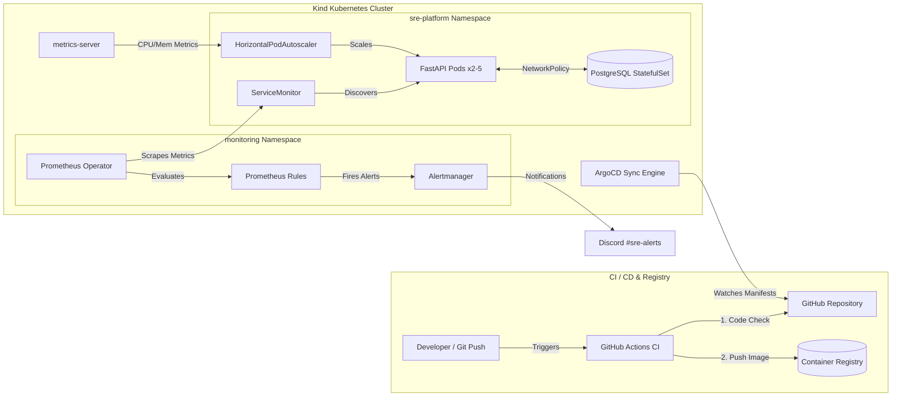

# Cloud-Native SRE & GitOps Platform

Welcome to my enterprise-grade SRE portfolio project! This repository is a Mono-repo designed to showcase a fully automated, secure, and observable cloud-native application deployment.

## Architecture Diagram


```mermaid
graph LR
    subgraph CI [CI / CD & Registry]
        Dev[Developer / Git Push] -->|Triggers| GHA[GitHub Actions CI]
        GHA -->|1. Code Check| GitRepo[GitHub Repository]
        GHA -->|2. Push Image| Registry[(Container Registry)]
    end

    subgraph Cluster [Kind Kubernetes Cluster]
        ArgoCD[ArgoCD Sync Engine] -->|Watches Manifests| GitRepo

        subgraph SRE_NS [sre-platform Namespace]
            FastAPI[FastAPI Pods x2-5] <-->|NetworkPolicy| Postgres[(PostgreSQL StatefulSet)]
            ServiceMonitor[ServiceMonitor] -->|Discovers| FastAPI
            HPA[HorizontalPodAutoscaler] -->|Scales| FastAPI
        end

        MetricsServer[metrics-server] -->|CPU/Mem Metrics| HPA

        subgraph Mon_NS [monitoring Namespace]
            Prometheus[Prometheus Operator] -->|Scrapes Metrics| ServiceMonitor
            Prometheus -->|Evaluates| Rules[Prometheus Rules]
            Rules -->|Fires Alerts| Alertmanager[Alertmanager]
        end
    end

    Alertmanager -->|Notifications| Discord[Discord #sre-alerts]
```

This project is built incrementally, focusing on Site Reliability Engineering (SRE) best practices, automated quality gates, and GitOps workflows:

* **1: CI Pipeline & Docker Containerization with Security Scanning** 🟢 (Completed)
* **2: Local Kubernetes Orchestration (Kind) & Helm Charts Packaging** 🟢 (Completed)
* **3: GitOps Continuous Delivery with ArgoCD & Sealed Secrets** 🟢 (Completed)
* **4: Observability & Production-Grade Alerting (kube-prometheus-stack & Alertmanager)** 🟢 (Completed)
* **5: Autoscaling & Load Testing (metrics-server, HPA, Locust)** 🟢 (Completed)
* **6: Distributed Tracing & Chaos Engineering (OpenTelemetry, Jaeger)** ⏳ (**Current Stage**)
* **7: Infrastructure as Code (Terraform)** ⏳

---

## 🛠️ Tech Stack & SRE Tools

* **Application:** FastAPI (Python 3.12), Pydantic, SQLAlchemy, PostgreSQL
* **Orchestration & Packaging:** Kubernetes, Helm v3, Kind (Kubernetes in Docker)
* **GitOps & Continuous Delivery:** ArgoCD, Bitnami Sealed Secrets
* **Observability & Monitoring:** Prometheus Operator (`kube-prometheus-stack`), Alertmanager, Grafana, `kube-state-metrics`, custom `prometheus_client` instrumentation
* **Autoscaling & Load Testing:** Kubernetes HPA (`autoscaling/v2`), `metrics-server`, Locust
* **CI/CD:** GitHub Actions
* **Containerization:** Docker (Multi-stage builds, Bookworm slim images)
* **Security & Hardening:** Trivy CLI (Vulnerability Scans), Network Policies, Non-root containers, Sealed Secrets encryption (TLS public key sealing)
* **Quality Gates:** Black (Formatter), Ruff (Linter), Pytest & Pytest-Cov (Unit Tests & Coverage)

---

## 🟢 1st Milestone: Secure CI/CD Pipeline

The first phase of the platform is fully complete and operational. Every git push triggers a robust automated pipeline:

### 1. Code Quality & Testing

* **Linter & Formatter:** Code is strictly checked via `ruff` and `black` to maintain enterprise code styling.
* **Automated Tests:** Unit tests run automatically using `pytest`, generating test coverage reports.

### 2. Multi-stage Docker Builds

* The application is packaged into a highly optimized, multi-stage Docker image using a secure non-root base (`python:3.12-slim-bookworm`).
* Builds are extremely fast (under 25 seconds) and produce minimum-sized artifacts.

### 3. Proactive Security Scanning (Trivy CLI)

* **Filesystem Scan:** Scans the source code for exposed secrets and dependency vulnerabilities before building.
* **Container Image Scan:** Scans the final Docker image layer-by-layer for high and critical vulnerabilities.

> **SRE Implementation Note (Supply-Chain Security):** Instead of relying on a third-party GitHub Action, the pipeline installs and runs the native Trivy CLI directly on the runner. This gives complete control over the security testing environment, and lets the same scan be run identically on a developer's own machine.
> **SRE Implementation Note (Vulnerability Triage):** The pipeline uses `--ignore-unfixed`, so it only fails the build on vulnerabilities that actually have an available patch. Base-image CVEs without an upstream fix (common in any Debian/Python base image) are visible in scan output but don't block delivery — the goal is actionable signal, not noise.

---

## 🟢 2nd Milestone: Local Kubernetes & Helm Packaging (Reliability & Security Hardening)

The second phase transitions the containerized application into an enterprise-ready, self-healing Kubernetes cluster locally.

### 1. Local Kubernetes Clustering (Kind)

* Configured a lightweight local Kubernetes cluster using **Kind** (`kind-config.yaml`) with customized control-plane settings and extra port mappings (80/443) pre-configured to receive an Ingress controller in future steps.

### 2. Enterprise Helm Chart Packaging (`sre-platform-app`)

* Instead of relying on `helm create` boilerplate, the entire environment (FastAPI + Postgres) was hand-built and packaged using **Helm v3**, so every template is understood and intentional.
* Fully decoupled environment configuration from code using a centralized `values.yaml` file, allowing seamless multi-environment deployments.

### 3. High-Availability & Stateful Data (PostgreSQL StatefulSet)

* Deployed PostgreSQL using a **StatefulSet** (instead of a simple Deployment) to guarantee a stable network identity (`postgres-0`) and dedicated Persistent Volume Claims (PVC) for data durability.
* Bound the database to a **Headless Service** (`sre-platform-app-postgres-headless`) to enable reliable DNS-based pod discovery.

### 4. Zero-Trust Network Security (Network Policies)

* Enforced a strict `Default-Deny` ingress **NetworkPolicy** on the database pod.
* Explicitly allows inbound connections **only** from pods matching the FastAPI label selector, on port `5432`. All other network traffic — other namespaces, other pods, a compromised shell — is blocked.

### 5. Self-Healing & Probes (Reliability Engineering)

Three distinct health endpoints, each backing a different Kubernetes probe:

* **Startup Probe** (`/health/startup`): gives the app time to complete schema initialization before liveness/readiness checks even begin.
* **Liveness Probe** (`/health/live`): restarts the container if the process itself locks up. Deliberately does **not** check the database — a slow DB should never cause Kubernetes to kill an otherwise-healthy pod.
* **Readiness Probe** (`/health/ready`): performs an active database check (`SELECT 1`). If it fails, Kubernetes stops routing traffic to that pod without restarting it.

### 6. Zero-Downtime Rollouts

* `RollingUpdate` strategy with `maxSurge: 25%` / `maxUnavailable: 0` — new pods must pass their readiness probe and start receiving traffic before any old pod is terminated.

---

## 🟢 3rd Milestone: GitOps Continuous Delivery (ArgoCD & Sealed Secrets)

The third phase replaces manual `helm install`/`helm upgrade` commands with a fully automated, self-healing GitOps workflow.

### 1. ArgoCD — Pull-Based Deployment

* ArgoCD runs **inside** the cluster and continuously watches this repository's `charts/sre-platform-app` path.
* Any change pushed to `main` is automatically detected, rendered via Helm, and applied to the cluster — no CI pipeline ever needs `kubeconfig` credentials.
* `syncPolicy.automated` is configured with:
* `selfHeal: true` — if someone manually edits a live resource (`kubectl edit`), ArgoCD reverts it back to match Git on the next reconciliation.
* `prune: true` — resources removed from Git are automatically removed from the cluster.

* **Verified live:** scaling the FastAPI deployment from 1 → 2 replicas was done entirely by editing `replicaCount` in `values.yaml` and pushing to Git — zero manual `kubectl`/`helm` commands touched the cluster.

### 2. Bitnami Sealed Secrets — Git-Safe Credential Management

* The PostgreSQL credentials are **never** committed as plaintext. Instead, `kubeseal` encrypts them client-side into a `SealedSecret` custom resource, which is safe to publish in a public GitHub repository.
* Only the Sealed Secrets controller running inside this specific cluster holds the private key needed to decrypt it.
* On sync, the controller automatically decrypts the `SealedSecret` into a regular Kubernetes `Secret`, consumed transparently by the FastAPI and PostgreSQL pods via `secretKeyRef`.

---

## 🟢 4th Milestone: Observability & Production-Grade Alerting

The fourth phase implements full-stack observability and real-time alerting using the **kube-prometheus-stack** operator ecosystem.

### 1. Enterprise Prometheus & Target Discovery Optimization

* Deployed the full **Prometheus Operator** stack in the `monitoring` namespace.
* Fine-tuned `values-override.yaml` with `ruleSelectorNilUsesHelmValues: false` and `ruleNamespaceSelector: {}` to allow Prometheus to automatically discover custom `PrometheusRule` Custom Resources across all cluster namespaces.
* Suppressed un-scrapable Kind control-plane targets (kubeScheduler, kubeEtcd, kubeProxy) to maintain a clean `100% UP` target health status on `localhost:9090/targets`.

### 2. Custom SRE Alerting Rules (`PrometheusRule`)

Implemented 5 key production-grade alerting rules packaged inside `charts/sre-platform-app/templates/prometheusrules.yaml`:

* **`FastAPIHighErrorRate`:** Triggers when HTTP 5xx errors exceed 5% of total requests over a 5-minute window.
* **`FastAPIPodDown`:** Triggers when Prometheus can no longer scrape the FastAPI target at all (`up == 0` for the `sre-platform-app-fastapi` job).
* **`FastAPIHighLatency`:** Triggers when the 95th percentile request latency exceeds 500ms over 5 minutes.
* **`PostgresDown`:** Uses `kube_pod_status_ready` via `kube-state-metrics` to instantly alert if the database StatefulSet pod fails or goes unready.
* **`FastAPIPodRestarting`:** Triggers immediately on any container restart detected within a 5-minute window (`increase(...restarts_total[5m]) > 0`).

### 3. Alertmanager & Real-Time Discord Integration

* Configured **Alertmanager** with custom routing rules and a native `discord_configs` receiver (supported directly since Alertmanager v0.25) to push alert notifications straight to a dedicated Discord channel (`#sre-alerts`).
* Validated full end-to-end alerting lifecycle by triggering a real alert through the Alertmanager API and confirming delivery in Discord within seconds — including live `[FIRING]` notifications for both custom SRE rules and the operator's own built-in meta-alerts (`Watchdog`, `AlertmanagerFailedToSendAlerts`).

### 4. GitOps-Compliant Sealed Alertmanager Credentials

* Encrypted the full `alertmanager.yaml` (including the Discord webhook URL) client-side using `kubeseal` into `monitoring/manifests/sealedsecret-alertmanager.yaml`.
* The encrypted secret is committed safely to Git, and automatically decrypted in-cluster into the `alertmanager-config` Secret for Alertmanager to consume — applied automatically via a dedicated ArgoCD manifest source (`monitoring/manifests/`), not a one-off manual `kubectl apply`.

> **Incident note:** during initial setup, a webhook URL was briefly committed in plaintext before the SealedSecret was in place. It was rotated (old webhook revoked, new one generated) and the plaintext file was removed from the repository as soon as it was caught. Documented here deliberately — catching and correctly remediating a credential leak is itself a real SRE skill.

---

## 🟢 5th Milestone: Autoscaling & Load Testing

The fifth phase proves the platform doesn't just observe itself — it reacts automatically to real load, survives a real investigation into *why* it didn't at first, and comes out the other side with a documented fix and a clean, reproducible result.

### 1. Metrics Pipeline for Autoscaling (`metrics-server`)

* Deployed the official Kubernetes `metrics-server` into `kube-system` to supply the CPU/memory metrics the HPA needs (`kubectl top nodes/pods`).
* Kind's kubelet doesn't present a certificate `metrics-server` trusts by default, so it required one runtime patch on the deployment args: `--kubelet-insecure-tls`. This is a known, accepted trade-off for local Kind clusters — a managed/cloud cluster (EKS/GKE/AKS) wouldn't need this flag.

### 2. HorizontalPodAutoscaler for FastAPI

* Added `hpa.yaml` to the Helm chart (`autoscaling/v2`), targeting the FastAPI `Deployment`: `minReplicas: 2`, `maxReplicas: 5`, target `50%` average CPU utilization against the container's `100m` CPU request.
* Fully decoupled from code, same as every other setting — controlled centrally via `values.yaml` (`app.autoscaling.*`) and synced automatically by ArgoCD.
* **Verified live:** generating sustained CPU load against the app drove the deployment from 2 → 4 → 5 replicas automatically, and scaled back down to 2 once load stopped — observed directly via `kubectl get hpa -n sre-platform --watch`.

> **SRE Implementation Note (Silent Template Failure):** the first version of `hpa.yaml` called a Helm named template (`sre-platform-app.fullname`) that was never defined in `_helpers.tpl`. ArgoCD still reported the Application as `Synced` / `Healthy`, which masked the problem completely — the HPA resource simply never existed in the cluster. Running `helm template` locally was what actually surfaced the broken `include` call. Fixed by referencing `.Release.Name` / `.Release.Namespace` / `.Chart.Name` directly instead of a nonexistent helper. Lesson: a green ArgoCD status confirms Git and cluster *state* match — it doesn't confirm a broken manifest rendered anything at all.

### 3. Load Testing — Methodology, Root-Cause Investigation, and Fix

* First attempt used `kubectl port-forward` from a local Locust run against `/health/ready`. At 300 concurrent users, **94% of requests failed**. Investigation traced this to `kubectl port-forward` itself — a single relayed tunnel through the Kubernetes API server, never designed to carry hundreds of concurrent connections (confirmed via repeated `portforward.go: connection reset by peer` on the client side). The HPA scaled correctly under this same load, ruling out the app. **Fix:** moved Locust *into* the cluster as a Kubernetes `Job` (`loadtest/job.yaml`) hitting the `ClusterIP` Service directly, and expanded the test to a realistic CRUD mix (`GET/POST /users`, `GET /users/{id}`, `GET /health/ready`) instead of hammering one endpoint.
* The first in-cluster run (150 users, real traffic mix) surfaced **genuine** failures this time — up to ~35% failure rate, with literal HTTP 500s. `kubectl top pods` showed every FastAPI pod pegged exactly at the `200m` CPU limit — CFS throttling, confirmed, while PostgreSQL sat idle (<50m). Code review found `DB_POOL_SIZE=5` / `DB_MAX_OVERFLOW=5` / `DB_POOL_TIMEOUT=5s` hardcoded and not exposed as env vars: under CPU throttling, requests held DB connections longer, the small pool exhausted, and the timeout surfaced as an unhandled `TimeoutError` → HTTP 500. A separate, compounding bug: `GET /users` had no pagination, scanning the entire (continuously growing, from the test's own `POST`s) table on every call.
* **First fix attempt:** raised the CPU limit `200m → 500m` and the DB pool to `10+10` with a `10s` timeout. Result: failure rate improved (34.97% → 19.86%) but **p95 latency got worse** (12s → 28s) — the longer timeout let requests queue instead of failing fast, trading one failure mode for a slower one. Kept as a deliberate, documented lesson rather than quietly overwritten.
* **Second fix:** added pagination to `GET /users` (default page size 20, hard cap 100) and reverted `DB_POOL_TIMEOUT` to `5s` (fail-fast) while keeping the larger pool size (a genuine capacity gain, independent of the timeout issue).
* **Final result:** **29,286 requests, 0 failures (0.00%)** at 150 concurrent users over 3 minutes. p95 latency **~1.2s** (down from ~21–28s across the earlier attempts), steady throughput of **~165 req/s**.

> **SRE Implementation Note (Fix ≠ Fix):** the first remediation attempt made one metric better and a different one worse — a genuine reminder that "the failure rate went down" isn't the same as "the problem is fixed." Root-causing the *actual* bottleneck (CPU limit + connection pool + an unbounded query) rather than just loosening timeouts is what got both metrics to improve together.

### 4. Chaos / Resilience Test — Self-Healing Under Load

* While a moderate load test was running (60 concurrent users), force-killed a live FastAPI pod at a controlled point in the run (`kubectl delete pod --grace-period=0 --force`).
* Result: **20,592 requests, 0.09% failure rate** (18 requests) — all `ConnectionRefusedError`, clustered in the few seconds around the kill, none afterward. Kubernetes replaced the pod automatically; the remaining replicas and the readiness probe absorbed the rest of the traffic without any application-level errors.

---

## 🧠 SRE Interview Notes: Key Architectural Decisions

**Why ArgoCD (GitOps/Pull) instead of deploying straight from GitHub Actions (Push)?**

> With a push model, the CI system needs the cluster's `kubeconfig` credentials — an external system holding keys to production infrastructure. With ArgoCD, the controller runs inside the cluster and only needs read access to the Git repo. No inbound firewall ports, no exposed cluster credentials, and automatic drift correction if the live state ever diverges from Git.

**Why StatefulSet instead of Deployment for PostgreSQL?**

> The database needs a stable network identity and dedicated persistent storage tied to that identity. A Deployment's pods are interchangeable; a StatefulSet's are not — `postgres-0` always gets the same PVC back, even after a restart or reschedule.

**Why three separate health endpoints instead of one?**

> Liveness and readiness answer different questions. Liveness asks "is the process alive?" — a slow database should never trigger a restart here. Readiness asks "can this pod serve traffic right now?" — an active DB check that pulls the pod out of rotation without killing it. Conflating the two causes cascading restarts during a transient database hiccup.

**Why `kube_pod_status_ready` over `postgres_exporter` for DB Down alerting?**

> In lightweight Kubernetes deployments, running an extra exporter sidecar adds unnecessary memory overhead. Leveraging `kube-state-metrics` natively exposes pod readiness (`kube_pod_status_ready`) for the PostgreSQL StatefulSet, giving an accurate, immediate signal without extra operational bloat.

**Why Sealed Secrets for Alertmanager Webhooks?**

> Webhook URLs contain sensitive tokens that allow unauthorized third parties to spam or spoof alerts. Sealing the Alertmanager configuration file client-side ensures that sensitive credentials remain strictly encrypted at rest inside Git while staying 100% compliant with GitOps practices.

**The first Locust run showed a 94% failure rate — was the app failing under load?**

> No — the HPA scaled the deployment correctly under the exact same load, which rules out the application and the cluster's request path. The failures were `kubectl port-forward` itself breaking down under hundreds of concurrent connections. It's a reminder to always identify *where* a load test's traffic actually flows before trusting its numbers — a local port-forward tunnel is part of the test harness, not the system under test.

**The first real fix cut the failure rate in half but made latency worse — what does that mean?**

> It meant the fix treated a symptom (requests failing) rather than the cause (insufficient CPU headroom and an unbounded query). Raising the DB pool timeout gave failing requests more time to queue instead of failing fast, which looks better in a failure-rate metric while actually making the user-facing experience worse. The real fix was pagination plus right-sized CPU — after which both failure rate *and* latency improved together, which is the signal that the actual bottleneck was addressed rather than papered over.

---

## 🏁 Repository Structure

```text
cloud-native-sre-platform/
├── .github/workflows/ci.yml    # Lint, test, Trivy scans (fs + image), Docker build
├── app/
│   ├── src/                    # FastAPI app: routes, DB layer, Prometheus metrics
│   ├── tests/                  # Pytest unit tests
│   ├── Dockerfile              # Multi-stage, non-root, hardened
│   └── requirements.txt
├── argocd/                     # ArgoCD Application definitions (GitOps entrypoints)
├── charts/sre-platform-app/    # Helm chart: Deployment, HPA, NetworkPolicy, StatefulSet, Service, SealedSecret
├── monitoring/                 # kube-prometheus-stack overrides + sealed Alertmanager config
├── loadtest/                   # In-cluster Locust Job manifests (stress test + chaos test)
├── locustfile.py               # Load test scenarios (CRUD mix: /users, /health)
├── kind-config.yaml             # Local Kind cluster definition
├── pyproject.toml               # Explicit Ruff rule selection (pinned, version-independent)
├── .trivyignore                 # Documented, investigated scanner false-positive suppressions
└── README.md
```

---

## 🚀 Coming Next

* **Milestone 6 (Tracing & Chaos Engineering):** OpenTelemetry & Jaeger integration for distributed tracing across FastAPI → PostgreSQL, plus scripted chaos scenarios beyond the manual pod-kill test above (network latency injection, dependency failure simulation).
* **Milestone 7 (IaC):** Terraform blueprint for cloud infrastructure deployment, validated in CI pipelines.